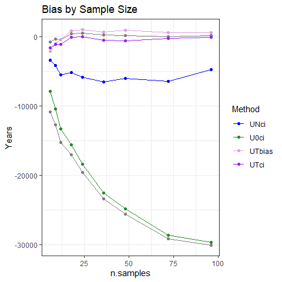
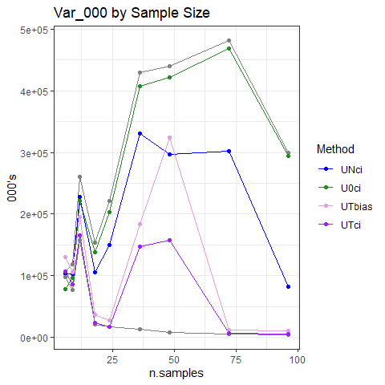
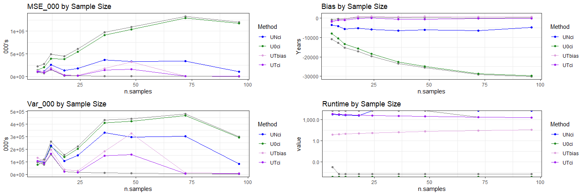
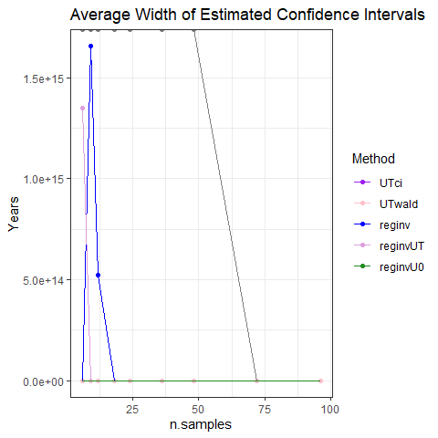
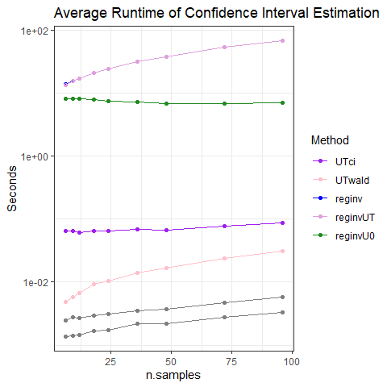

Simulation Results
================
Victor Tsang and David Warton
27 September, 2023

- <a href="#tldr" id="toc-tldr">TL;DR</a>
- <a href="#point-estimates" id="toc-point-estimates">Point Estimates</a>
  - <a href="#show-point-estimation-metrics-for-key-methods"
    id="toc-show-point-estimation-metrics-for-key-methods">Show point
    estimation metrics for key methods</a>
  - <a href="#plots" id="toc-plots">Plots</a>
  - <a href="#commentary" id="toc-commentary">Commentary</a>
- <a href="#confidence-intervals" id="toc-confidence-intervals">Confidence
  Intervals</a>
  - <a href="#show-ci-metrics-for-key-methods"
    id="toc-show-ci-metrics-for-key-methods">Show CI metrics for key
    methods</a>
  - <a href="#coverage-probability" id="toc-coverage-probability">Coverage
    Probability</a>
  - <a href="#widths" id="toc-widths">Widths</a>
  - <a href="#runtime" id="toc-runtime">Runtime</a>
  - <a href="#commentary-1" id="toc-commentary-1">Commentary</a>

# TL;DR

- MINMI point estimates aren’t as accurate as MLE under Uniform-Normal
  (UN) model
- MINMI point estimates appear to be more biased than MLE
- main issue is that MINMI has much higher sample variance - and not
  decreasing with sample size!!
- The issue here is that sample minimum is not a good statistic for
  measurement error scenarios :(
- Coverage probability of MINMI and MLE_INV is good, asymptotic MLE is
  good except at low sample size and low measurement error

#### Which value of `error_factor` do we want plots for?

``` r
error_fac_to_plot = 64 #change this value to look at plots for a different error_factor
```

#### Which sim run do we want plots for?

``` r
whichDate = "20230926" #change this value to date of sim run
```

------------------------------------------------------------------------

#### Load in the results

``` r
library(knitr)
library(tidyverse)
library(scales)
library(ggrepel)
library(gridExtra)
library(latex2exp)


load("data/synthetic-data-6-20230901.RData")
attach(synthetic.data.config)

RESULTS_PATH <- paste0('data/simResults-6-',whichDate,'.RData')
load(RESULTS_PATH)

head(results)
```

    ##   which_sim n.samples error_factor  method    lower     point    upper
    ## 1         1         6            0  BA-MLE       NA  8728.782       NA
    ## 2         1         6            0 Strauss       NA  8521.504       NA
    ## 3         1         6            0   GRIWM 5517.000  5517.000  5517.00
    ## 4         1         6            0    U0ci 6693.891 10338.956 10338.96
    ## 5         1         6            0    UNci 6693.891 10338.956 10338.96
    ## 6         1         6            0    UTci 6693.891 10338.956 10338.96
    ##   point_runtime conf_int_runtime B.lower B.point B.upper
    ## 1  0.0001630783               NA      NA      NA      NA
    ## 2  0.0019938946               NA      NA      NA      NA
    ## 3  0.9487740993      0.948774099      NA      NA      NA
    ## 4  0.0000000000      0.003574848      NA      NA      NA
    ## 5  0.0000000000      0.001688957      NA      NA      NA
    ## 6  0.0000000000      0.001697302      NA      NA      NA

``` r
all_results=results
all_results$n.samples = synthetic.data.config$n.samples
all_results=all_results[0,]

n.samples=c(6,9,12,18,24,36,48,72,96)
for (iSample in 1:length(n.samples))
{
  RESULTS_PATH <- paste0("data/simResults-",n.samples[iSample],"-",whichDate,".RData")
  load(RESULTS_PATH)
  all_results=tibble::add_row(
      all_results,
      error_factor = results$error_factor,
      method=results$method,
      lower=results$lower,
      point=results$point,
      upper=results$upper,
      point_runtime=results$point_runtime,
      conf_int_runtime=results$conf_int_runtime,
      B.lower=results$B.lower,
      B.point=results$B.point,
      B.upper=results$B.upper,
      n.samples=n.samples[iSample]
  )
}
```

``` r
all_results %>%
  group_by(method, error_factor, n.samples) %>%
  summarise(point.pct_na = mean(point,na.rm=TRUE),
            lower.pct_na = mean(lower,na.rm=TRUE),
            upper.pct_na = mean(upper,na.rm=TRUE))
```

    ## `summarise()` has grouped output by 'method', 'error_factor'. You can override
    ## using the `.groups` argument.

    ## # A tibble: 1,053 × 6
    ## # Groups:   method, error_factor [117]
    ##    method error_factor n.samples point.pct_na lower.pct_na upper.pct_na
    ##    <chr>         <dbl>     <dbl>        <dbl>        <dbl>        <dbl>
    ##  1 BA-MLE          0           6       10053.          NaN          NaN
    ##  2 BA-MLE          0           9       10040.          NaN          NaN
    ##  3 BA-MLE          0          12        9993.          NaN          NaN
    ##  4 BA-MLE          0          18        9995.          NaN          NaN
    ##  5 BA-MLE          0          24        9996.          NaN          NaN
    ##  6 BA-MLE          0          36       10009.          NaN          NaN
    ##  7 BA-MLE          0          48       10005.          NaN          NaN
    ##  8 BA-MLE          0          72       10010.          NaN          NaN
    ##  9 BA-MLE          0          96       10010.          NaN          NaN
    ## 10 BA-MLE          0.5         6       10008.          NaN          NaN
    ## # ℹ 1,043 more rows

# Point Estimates

#### Calculate Metrics

``` r
performance.point <- all_results %>%
  filter(!is.na(point),method%in%c("BA-MLE","U0ci","UNci","UTci","UTbias","UT4ci"),error_factor == error_fac_to_plot) %>%
  group_by(method, n.samples) %>%
  summarise(MSE_000 = mean((point - theta.true)^2,na.rm=TRUE)/1000,
            bias = mean(point,na.rm=TRUE)-theta.true,
            variance_000 = var(point,na.rm=TRUE)/1000,
            avg_runtime = round(mean(point_runtime,na.rm=TRUE), 5))
```

    ## `summarise()` has grouped output by 'method'. You can override using the
    ## `.groups` argument.

``` r
performance.point.tbl = vector(mode = "list", length(n.samples))

for (i in 1:length(n.samples)) {
  performance.point.tbl[[i]] <- performance.point %>%
    filter(n.samples == n.samples[i]) %>%
    ungroup() %>%
    mutate(across(!c(method, n.samples, avg_runtime), round)) %>%
    mutate(avg_runtime = round(avg_runtime, digits = 5)) %>%
    arrange(MSE_000)
}

performance.point.tbl[[1]]
```

    ## # A tibble: 6 × 6
    ##   method n.samples MSE_000   bias variance_000 avg_runtime
    ##   <chr>      <dbl>   <dbl>  <dbl>        <dbl>       <dbl>
    ## 1 UT4ci          6   98375   -774        97873   Inf      
    ## 2 UTci           6  108700  -1581       106306  6743.     
    ## 3 UNci           6  114140  -3399       102688  5829.     
    ## 4 UTbias         6  134756  -2127       130362     7.53   
    ## 5 U0ci           6  140726  -7893        78507     0      
    ## 6 BA-MLE         6  225016 -10875       106857     0.00018

``` r
performance.point.tbl[[2]]
```

    ## # A tibble: 6 × 6
    ##   method n.samples MSE_000   bias variance_000 avg_runtime
    ##   <chr>      <dbl>   <dbl>  <dbl>        <dbl>       <dbl>
    ## 1 UT4ci          9   76414   -278        76413   Inf      
    ## 2 UTci           9   86845  -1046        85837  5717.     
    ## 3 UTbias         9  106444   -975       105599     8.60   
    ## 4 UNci           9  119809  -4139       102785  4850.     
    ## 5 U0ci           9  204238 -10418        95806     0      
    ## 6 BA-MLE         9  279103 -12686       118279     0.00002

``` r
performance.point.tbl[[3]]
```

    ## # A tibble: 6 × 6
    ##   method n.samples MSE_000   bias variance_000 avg_runtime
    ##   <chr>      <dbl>   <dbl>  <dbl>        <dbl>       <dbl>
    ## 1 UT4ci         12  157100   -370       157121   Inf      
    ## 2 UTci          12  165969  -1076       164977  5068.     
    ## 3 UTbias        12  195961   -414       195985     9.50   
    ## 4 UNci          12  258493  -5503       228434  4307.     
    ## 5 U0ci          12  398633 -13304       221870     0      
    ## 6 BA-MLE        12  492554 -15246       260389     0.00002

Ignore run-times - I used that to store SEs for UN

#### Pivot to make plots and filter to `error_factor`

``` r
performance.point.long <- performance.point %>%
  rename(Method = method, n.samples = n.samples, Bias = bias, Var_000 = variance_000, Runtime = avg_runtime) %>%
  pivot_longer(cols=c(MSE_000, Bias, Var_000, Runtime), names_to = "Metric")
  
performance.point.long
```

    ## # A tibble: 216 × 4
    ## # Groups:   Method [6]
    ##    Method n.samples Metric         value
    ##    <chr>      <dbl> <chr>          <dbl>
    ##  1 BA-MLE         6 MSE_000 225016.     
    ##  2 BA-MLE         6 Bias    -10875.     
    ##  3 BA-MLE         6 Var_000 106857.     
    ##  4 BA-MLE         6 Runtime      0.00018
    ##  5 BA-MLE         9 MSE_000 279103.     
    ##  6 BA-MLE         9 Bias    -12686.     
    ##  7 BA-MLE         9 Var_000 118279.     
    ##  8 BA-MLE         9 Runtime      0.00002
    ##  9 BA-MLE        12 MSE_000 492554.     
    ## 10 BA-MLE        12 Bias    -15246.     
    ## # ℹ 206 more rows

## Show point estimation metrics for key methods

``` r
performance.point%>%filter(method=="BA-MLE")
```

    ## # A tibble: 9 × 6
    ## # Groups:   method [1]
    ##   method n.samples  MSE_000    bias variance_000 avg_runtime
    ##   <chr>      <dbl>    <dbl>   <dbl>        <dbl>       <dbl>
    ## 1 BA-MLE         6  225016. -10875.      106857.     0.00018
    ## 2 BA-MLE         9  279103. -12686.      118279.     0.00002
    ## 3 BA-MLE        12  492554. -15246.      260389.     0.00002
    ## 4 BA-MLE        18  444576. -17053.      153934.     0.00002
    ## 5 BA-MLE        24  605655. -19616.      221088.     0.00002
    ## 6 BA-MLE        36  978279. -23419.      430271.     0.00002
    ## 7 BA-MLE        48 1094306. -25596.      439600.     0.00002
    ## 8 BA-MLE        72 1330918. -29156.      481322.     0.00002
    ## 9 BA-MLE        96 1204150. -30075.      299964.     0.00002

``` r
performance.point%>%filter(method=="UTci")
```

    ## # A tibble: 9 × 6
    ## # Groups:   method [1]
    ##   method n.samples MSE_000    bias variance_000 avg_runtime
    ##   <chr>      <dbl>   <dbl>   <dbl>        <dbl>       <dbl>
    ## 1 UTci           6 108700. -1581.       106306.       6743.
    ## 2 UTci           9  86845. -1046.        85837.       5717.
    ## 3 UTci          12 165969. -1076.       164977.       5068.
    ## 4 UTci          18  23212.   -63.6       23231.       4279.
    ## 5 UTci          24  17056.   -16.5       17073.       3814.
    ## 6 UTci          36 147714.  -521.       147590.       3146.
    ## 7 UTci          48 157659.  -528.       157538.       2699.
    ## 8 UTci          72   6118.  -217.         6077.       2206.
    ## 9 UTci          96   5077.   -72.8        5077.       1944.

``` r
performance.point%>%filter(method=="UTbias")
```

    ## # A tibble: 9 × 6
    ## # Groups:   method [1]
    ##   method n.samples MSE_000   bias variance_000 avg_runtime
    ##   <chr>      <dbl>   <dbl>  <dbl>        <dbl>       <dbl>
    ## 1 UTbias         6 134756. -2127.      130362.        7.53
    ## 2 UTbias         9 106444.  -975.      105599.        8.60
    ## 3 UTbias        12 195961.  -414.      195985.        9.50
    ## 4 UTbias        18  37452.   847.       36770.       11.6 
    ## 5 UTbias        24  28740.  1007.       27754.       13.0 
    ## 6 UTbias        36 183406.   685.      183120.       16.6 
    ## 7 UTbias        48 324173.   927.      323637.       19.8 
    ## 8 UTbias        72  12145.   643.       11744.       27.8 
    ## 9 UTbias        96  10512.   638.       10115.       35.1

## Plots

``` r
metrics = unique(performance.point.long$Metric)
performance.point_estimates.plots = lapply(metrics,
  function(met) {
    p = ggplot(data = filter(performance.point.long, Metric == met),
               mapping = aes(x = n.samples, y = value, colour = reorder(Method, value, decreasing=T))) +
      geom_line() +
      geom_point() +
      theme_bw() +
      labs(title = paste(met, "by Sample Size"), ylab=NULL, colour = "Method") +
      theme(rect = element_rect(fill = "transparent")) +
      scale_color_manual(values = c("UNci" = "blue",
                                    "U0ci" = "forestgreen",
                                    "UTbias" = "plum",
                                    "UTci" = "purple"
                                    ))
    if (met %in% c("MSE", "Runtime")) {
      p = p+scale_y_log10(labels = label_comma())
    }
    p
  }
)

performance.point_estimates.plots[[1]] = performance.point_estimates.plots[[1]] + ylab("000's")
performance.point_estimates.plots[[2]] = performance.point_estimates.plots[[2]] + ylab("Years")
performance.point_estimates.plots[[3]] = performance.point_estimates.plots[[3]] + ylab("000's")

performance.point_estimates.plots[[1]]
```

<!-- -->

``` r
performance.point_estimates.plots[[2]]
```

<!-- -->

``` r
performance.point_estimates.plots[[3]]
```

<!-- -->

## Commentary

1.  MSE:
    1.  MINMI has much higher MSE than UN-MLE
    2.  MINMI MSE does not decrease as sample size increases (for large
        n)
2.  Bias:
    1.  MINMI is more biased than UN (mean vs median thing I guess)
3.  Variance:
    1.  MINMI estimates generally have more variance than UN, and not
        decreasing with sample size (for large n)

``` r
performance.point_estimates.plot.grid = do.call(grid.arrange, performance.point_estimates.plots)
```

    ## Warning: Transformation introduced infinite values in continuous y-axis
    ## Transformation introduced infinite values in continuous y-axis

<!-- -->

``` r
performance.point_estimates.plot.grid
```

    ## TableGrob (2 x 2) "arrange": 4 grobs
    ##   z     cells    name           grob
    ## 1 1 (1-1,1-1) arrange gtable[layout]
    ## 2 2 (1-1,2-2) arrange gtable[layout]
    ## 3 3 (2-2,1-1) arrange gtable[layout]
    ## 4 4 (2-2,2-2) arrange gtable[layout]

# Confidence Intervals

#### Calculate Metrics and Pivot

``` r
performance.CI <- all_results %>%
  filter(!is.na(conf_int_runtime), method%in%c("UTwald","UTci","reginvU0","reginv","reginvUT","UT4ci","UT4wald"), error_factor == error_fac_to_plot) %>%
  mutate(width = upper - lower,
         contains_theta = ifelse(theta.true > lower & theta.true < upper, 1, 0)) %>%
  group_by(n.samples, method) %>%
  summarise(Coverage = mean(contains_theta, na.rm=TRUE) * 100,
            `Average Width` = mean(width, na.rm=TRUE),
            `Trimmed Mean Width` = mean(width, trim=0.05, na.rm=TRUE),
            `Average Runtime` = mean(conf_int_runtime, na.rm=TRUE)) %>%
  ungroup() %>%
  arrange(method, n.samples)
```

    ## `summarise()` has grouped output by 'n.samples'. You can override using the
    ## `.groups` argument.

``` r
performance.CI.long <- performance.CI %>%
  rename(n.samples = n.samples, Method = method, Width = `Average Width`, Runtime = `Average Runtime`) %>%
  pivot_longer(cols=c(Coverage, Width, Runtime),
               names_to = "Metric")
  
performance.CI.long
```

    ## # A tibble: 189 × 5
    ##    n.samples Method `Trimmed Mean Width` Metric     value
    ##        <dbl> <chr>                 <dbl> <chr>      <dbl>
    ##  1         6 reginv               29156. Coverage 9.29e 1
    ##  2         6 reginv               29156. Width    1.35e 9
    ##  3         6 reginv               29156. Runtime  1.38e 1
    ##  4         9 reginv               24705. Coverage 9.34e 1
    ##  5         9 reginv               24705. Width    1.65e15
    ##  6         9 reginv               24705. Runtime  1.55e 1
    ##  7        12 reginv               23027. Coverage 9.5 e 1
    ##  8        12 reginv               23027. Width    5.20e14
    ##  9        12 reginv               23027. Runtime  1.70e 1
    ## 10        18 reginv               19465. Coverage 9.44e 1
    ## # ℹ 179 more rows

## Show CI metrics for key methods

``` r
performance.CI%>%filter(method%in%c("UTci","UT4ci"))
```

    ## # A tibble: 18 × 6
    ##    n.samples method Coverage `Average Width` `Trimmed Mean Width`
    ##        <dbl> <chr>     <dbl>           <dbl>                <dbl>
    ##  1         6 UT4ci      96.3          62643.               58287.
    ##  2         9 UT4ci      96.8          47855.               45085.
    ##  3        12 UT4ci      96.3          38731.               37020.
    ##  4        18 UT4ci      95.2          29560.               28331.
    ##  5        24 UT4ci      94.7          24185.               22925.
    ##  6        36 UT4ci      93.9          17880.               16649.
    ##  7        48 UT4ci      95.7          14018.               12915.
    ##  8        72 UT4ci      95.3          10092.                9227.
    ##  9        96 UT4ci      93.7           8326.                7880.
    ## 10         6 UTci       95.6        3549410.             3438255.
    ## 11         9 UTci       96.1        2851175.             2739654.
    ## 12        12 UTci       95.6        2298556.             2156621.
    ## 13        18 UTci       94.8        1742711.             1628784.
    ## 14        24 UTci       94.1        1393634.             1241778.
    ## 15        36 UTci       94.1         915037.              699389.
    ## 16        48 UTci       94.1         565396.              324194.
    ## 17        72 UTci       94.5         219788.               44728.
    ## 18        96 UTci       92.7          86113.                8360.
    ## # ℹ 1 more variable: `Average Runtime` <dbl>

``` r
performance.CI%>%filter(method=="reginvUT")
```

    ## # A tibble: 9 × 6
    ##   n.samples method   Coverage `Average Width` `Trimmed Mean Width`
    ##       <dbl> <chr>       <dbl>           <dbl>                <dbl>
    ## 1         6 reginvUT     93.2         1.35e15               29301.
    ## 2         9 reginvUT     93.9         2.66e 8               24789.
    ## 3        12 reginvUT     94.8         3.12e 7               22890.
    ## 4        18 reginvUT     94.3         2.06e 4               19484.
    ## 5        24 reginvUT     94.1         1.76e 4               17163.
    ## 6        36 reginvUT     93.6         1.43e 4               14279.
    ## 7        48 reginvUT     94.5         1.24e 4               12422.
    ## 8        72 reginvUT     94.7         1.01e 4               10071.
    ## 9        96 reginvUT     93.1         8.58e 3                8555.
    ## # ℹ 1 more variable: `Average Runtime` <dbl>

## Coverage Probability

``` r
conf_int.coverage.plot <- performance.CI.long %>%
  filter(Metric == "Coverage") %>%
  ggplot(aes(x=n.samples, y=value, colour=reorder(Method, value, decreasing=T))) +
  geom_point() +
  geom_line(linewidth=0.5) +
  geom_label_repel(aes(label = value)) +
  theme_bw() +
  labs(y = "Coverage probability", colour="Method", title="Coverage Probabilities") +
  scale_y_continuous(breaks=c(0, 25, 50, 75, 95, 100)) +
  theme(rect = element_rect(fill = "transparent")) +
      scale_color_manual(values = c("UTci" = "purple",
                                    "UTwald" = "pink",
                                    "reginv" = "blue",
                                    "reginvUT" = "plum",
                                    "reginvU0" = "forestgreen"))
```

    ## Warning: Ignoring unknown parameters: linewidth

``` r
conf_int.coverage.plot
```

    ## Warning: ggrepel: 54 unlabeled data points (too many overlaps). Consider
    ## increasing max.overlaps

<!-- -->

## Widths

``` r
conf_int.width.plot <- performance.CI.long %>%
  filter(Metric == "Width") %>%
  ggplot(aes(x=n.samples, y=value, colour=reorder(Method, value, decreasing=T))) +
  geom_point() +
  geom_line(linewidth=0.5) +
  theme_bw() +
  labs(y = "Years", colour="Method", title="Average Width of Estimated Confidence Intervals") +
  theme(rect = element_rect(fill = "transparent")) +
       scale_color_manual(values = c("UTci" = "purple",
                                    "UTwald" = "pink",
                                    "reginv" = "blue",
                                    "reginvUT" = "plum",
                                    "reginvU0" = "forestgreen"))
```

    ## Warning: Ignoring unknown parameters: linewidth

``` r
conf_int.width.plot
```

<!-- -->

## Runtime

``` r
conf_int.runtime.plot <- performance.CI.long %>%
  filter(Metric == "Runtime") %>%
  ggplot(aes(x=n.samples, y=value, colour=reorder(Method, value, decreasing=T))) +
  geom_point() +
  geom_line(linewidth=0.5) +
  theme_bw() +
  scale_y_continuous(trans=scales::log10_trans()) +
  labs(y = "Seconds", colour="Method", title="Average Runtime of Confidence Interval Estimation") +
  theme(rect = element_rect(fill = "transparent")) +
       scale_color_manual(values = c("UTci" = "purple",
                                    "UTwald" = "pink",
                                    "reginv" = "blue",
                                    "reginvUT" = "plum",
                                    "reginvU0" = "forestgreen"))
```

    ## Warning: Ignoring unknown parameters: linewidth

``` r
conf_int.runtime.plot
```

<!-- -->

## Commentary

1.  Coverage Probability:
    1.  MINMI generally has good coverage probability, as does MLE-INV
    2.  Asymptotic UN-MLE methods have good coverage at moderate-large
        sample sizes (but not for small n)
    3.  UN-Wald is slower to converge to desired coverage probability
        (symmetric CI)
2.  Confidence Interval Widths:
    1.  MINMI has way wider CIs
    2.  MINMI CI width does not decrease as sample size increases
3.  Runtime
    1.  MLE_INV takes ages, MINMI a bit longer(!) Although I was using
        B=100, might have been fairer to compare at B=100 instead of
        doing choose B first
