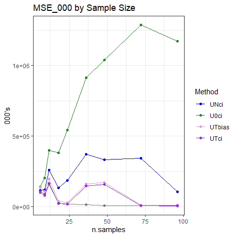
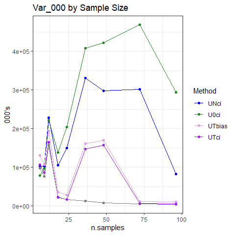
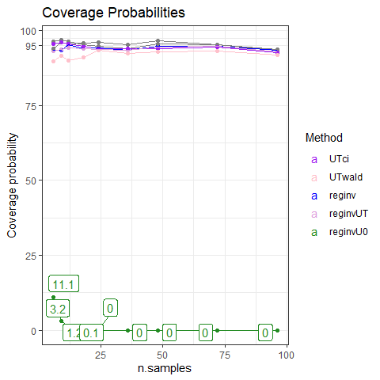

Simulation Results
================
Victor Tsang and David Warton
08 August, 2023

- <a href="#tldr" id="toc-tldr">TL;DR</a>
- <a href="#point-estimates" id="toc-point-estimates">Point Estimates</a>
  - <a href="#plots" id="toc-plots">Plots</a>
  - <a href="#commentary" id="toc-commentary">Commentary</a>
- <a href="#confidence-intervals" id="toc-confidence-intervals">Confidence
  Intervals</a>
  - <a href="#coverage-probability" id="toc-coverage-probability">Coverage
    Probability</a>
  - <a href="#widths" id="toc-widths">Widths</a>
  - <a href="#runtime" id="toc-runtime">Runtime</a>
  - <a href="#commentary-1" id="toc-commentary-1">Commentary</a>

# TL;DR

- MINMI point estimates aren’t as accurate as MLE under Uniform-Normal
  (UN) model
- MINMI point estimates appear to be more biased than MLE
- main issue is that MINMI has much higher sample variance - and not
  decreasing with sample size!!
- The issue here is that sample minimum is not a good statistic for
  measurement error scenarios :(
- Coverage probability of MINMI and MLE_INV is good, asymptotic MLE is
  good except at low sample size and low measurement error

#### Which value of `error_factor` do we want plots for?

``` r
error_fac_to_plot = 1 #change this value to look at plots for a different error_factor
```

------------------------------------------------------------------------

#### Load in the results

``` r
library(knitr)
library(tidyverse)
library(scales)
library(ggrepel)
library(gridExtra)
library(latex2exp)


load("data/synthetic-data-12-20230808.RData")
attach(synthetic.data.config)

RESULTS_PATH <- 'data/simResults-12-20230808.RData'
load(RESULTS_PATH)

head(results)
```

    ##   which_sim n.samples error_factor       method     lower     point    upper
    ## 1         1        12          0.0        MINMI  6514.271  9493.568 10062.30
    ## 2         1        12          0.0    mlereginv  6709.200        NA 10055.74
    ## 3         1        12          0.0   reginvUNci  8361.877 10083.248 10083.25
    ## 4         1        12          0.0 reginvUNwald 10083.248 10083.248 10083.25
    ## 5         2        12          0.5        MINMI  7730.791 10441.058 10980.00
    ## 6         2        12          0.5    mlereginv  7991.335        NA 10980.93
    ##   point_runtime conf_int_runtime B.lower B.point B.upper
    ## 1   0.002201080     2.201080e-03      NA      NA      NA
    ## 2   0.004814386     1.907247e+01      NA      NA      NA
    ## 3   0.000000000     2.302408e-03      NA      NA      NA
    ## 4   0.000000000     2.131462e-04      NA      NA      NA
    ## 5   0.254807472     2.548075e-01     100     100     100
    ## 6   0.002307892     2.082271e+01      NA      NA      NA

``` r
all_results=results
all_results$n.samples = synthetic.data.config$n.samples
all_results=all_results[0,]

n.samples=c(12,24,36,48,60)
#n.samples=c(12,24,36,48)
for (iSample in 1:length(n.samples))
{
  RESULTS_PATH <- paste0("data/simResults-",n.samples[iSample],"-20230808.RData")
  load(RESULTS_PATH)
  all_results=tibble::add_row(
      all_results,
      error_factor = results$error_factor,
      method=results$method,
      lower=results$lower,
      point=results$point,
      upper=results$upper,
      point_runtime=results$point_runtime,
      conf_int_runtime=results$conf_int_runtime,
      B.lower=results$B.lower,
      B.point=results$B.point,
      B.upper=results$B.upper,
      n.samples=n.samples[iSample]
  )
}
```

``` r
all_results %>%
  group_by(method, error_factor, n.samples) %>%
  summarise(point.pct_na = mean(point,na.rm=TRUE),
            lower.pct_na = mean(lower,na.rm=TRUE),
            upper.pct_na = mean(upper,na.rm=TRUE))
```

    ## `summarise()` has grouped output by 'method', 'error_factor'. You can override
    ## using the `.groups` argument.

    ## # A tibble: 120 × 6
    ## # Groups:   method, error_factor [24]
    ##    method error_factor n.samples point.pct_na lower.pct_na upper.pct_na
    ##    <chr>         <dbl>     <dbl>        <dbl>        <dbl>        <dbl>
    ##  1 MINMI           0          12       10227.        7456.       10756.
    ##  2 MINMI           0          24       10134.        8822.       10405.
    ##  3 MINMI           0          36       10070.        9208.       10253.
    ##  4 MINMI           0          48       10058.        9418.       10196.
    ##  5 MINMI           0          60       10057.        9548.       10167.
    ##  6 MINMI           0.5        12       10219.        7446.       10769.
    ##  7 MINMI           0.5        24       10117.        8804.       10423.
    ##  8 MINMI           0.5        36       10080.        9219.       10305.
    ##  9 MINMI           0.5        48       10064.        9424.       10250.
    ## 10 MINMI           0.5        60       10048.        9538.       10212.
    ## # … with 110 more rows

# Point Estimates

#### Calculate Metrics

``` r
performance.point <- all_results %>%
  filter(!is.na(point)) %>% filter(error_factor == error_fac_to_plot) %>%
  group_by(method, n.samples) %>%
  summarise(MSE_000 = mean((point - theta.true)^2,na.rm=TRUE)/1000,
            bias = mean(point,na.rm=TRUE)-theta.true,
            variance_000 = var(point,na.rm=TRUE)/1000,
            avg_runtime = round(mean(point_runtime,na.rm=TRUE), 5))
```

    ## `summarise()` has grouped output by 'method'. You can override using the
    ## `.groups` argument.

``` r
performance.point.tbl = vector(mode = "list", length(n.samples))

for (i in 1:length(n.samples)) {
  performance.point.tbl[[i]] <- performance.point %>%
    filter(n.samples == n.samples[i]) %>%
    ungroup() %>%
    mutate(across(!c(method, n.samples, avg_runtime), round)) %>%
    mutate(avg_runtime = round(avg_runtime, digits = 5)) %>%
    arrange(MSE_000)
}

performance.point.tbl[[1]]
```

    ## # A tibble: 3 × 6
    ##   method       n.samples MSE_000  bias variance_000 avg_runtime
    ##   <chr>            <dbl>   <dbl> <dbl>        <dbl>       <dbl>
    ## 1 MINMI               12     552   184          519      0.0279
    ## 2 reginvUNci          12     804   579          469    215.    
    ## 3 reginvUNwald        12     804   579          469    215.

``` r
performance.point.tbl[[2]]
```

    ## # A tibble: 3 × 6
    ##   method       n.samples MSE_000  bias variance_000 avg_runtime
    ##   <chr>            <dbl>   <dbl> <dbl>        <dbl>       <dbl>
    ## 1 MINMI               24     178   129          162      0.0474
    ## 2 reginvUNci          24     241   294          155    169.    
    ## 3 reginvUNwald        24     241   294          155    169.

``` r
performance.point.tbl[[3]]
```

    ## # A tibble: 3 × 6
    ##   method       n.samples MSE_000  bias variance_000 avg_runtime
    ##   <chr>            <dbl>   <dbl> <dbl>        <dbl>       <dbl>
    ## 1 MINMI               36     105    70          100      0.0721
    ## 2 reginvUNci          36     126   168           98    147.    
    ## 3 reginvUNwald        36     126   168           98    147.

Ignore run-times - I used that to store SEs for UN

#### Pivot to make plots and filter to `error_factor`

``` r
performance.point.long <- performance.point %>%
  rename(Method = method, n.samples = n.samples, Bias = bias, Var_000 = variance_000, Runtime = avg_runtime) %>%
  pivot_longer(cols=c(MSE_000, Bias, Var_000, Runtime), names_to = "Metric")
  
performance.point.long
```

    ## # A tibble: 60 × 4
    ## # Groups:   Method [3]
    ##    Method n.samples Metric     value
    ##    <chr>      <dbl> <chr>      <dbl>
    ##  1 MINMI         12 MSE_000 552.    
    ##  2 MINMI         12 Bias    184.    
    ##  3 MINMI         12 Var_000 519.    
    ##  4 MINMI         12 Runtime   0.0279
    ##  5 MINMI         24 MSE_000 178.    
    ##  6 MINMI         24 Bias    129.    
    ##  7 MINMI         24 Var_000 162.    
    ##  8 MINMI         24 Runtime   0.0474
    ##  9 MINMI         36 MSE_000 105.    
    ## 10 MINMI         36 Bias     70.2   
    ## # … with 50 more rows

### Plots

``` r
metrics = unique(performance.point.long$Metric)
performance.point_estimates.plots = lapply(metrics,
  function(met) {
    p = ggplot(data = filter(performance.point.long, Metric == met),
               mapping = aes(x = n.samples, y = value, colour = reorder(Method, value, decreasing=T))) +
      geom_line() +
      geom_point() +
      theme_bw() +
      labs(title = paste(met, "by Error"), ylab=NULL, colour = "Method") +
      theme(rect = element_rect(fill = "transparent")) +
      scale_color_manual(values = c("MINMI" = "#00BA38",
                                    "MLE" = "#619CFF",
                                    "BA-MLE" = "purple",
                                    "Strauss" = "orange",
                                    "GRIWM-corrected" = "darkgray",
                                    "GRIWM" = "maroon",
                                    "reginvUNci" = "darkblue",
                                    "reginvUNwald" = "red",
                                    "mlereginv" = "purple",
                                    "mleInv2" = "plum",
                                    "mleInvP"="orchid",
                                    "mleInvAW" = "pink"))
    
    if (met %in% c("MSE", "Runtime")) {
      p = p+scale_y_log10(labels = label_comma())
    }
    p
  }
)

performance.point_estimates.plots[[1]] = performance.point_estimates.plots[[1]] + ylab("000's")
performance.point_estimates.plots[[2]] = performance.point_estimates.plots[[2]] + ylab("Years")
performance.point_estimates.plots[[3]] = performance.point_estimates.plots[[3]] + ylab("000's")

performance.point_estimates.plots[[1]]
```

<!-- -->

``` r
performance.point_estimates.plots[[2]]
```

<!-- -->

``` r
performance.point_estimates.plots[[3]]
```

<!-- -->

## Commentary

1.  MSE:
    1.  MINMI has much higher MSE than UN-MLE
    2.  MINMI MSE does not decrease as sample size increases (for large
        n)
2.  Bias:
    1.  MINMI is more biased than UN (mean vs median thing I guess)
3.  Variance:
    1.  MINMI estimates generally have more variance than UN, and not
        decreasing with sample size (for large n)

``` r
performance.point_estimates.plot.grid = do.call(grid.arrange, performance.point_estimates.plots)
```

<!-- -->

``` r
performance.point_estimates.plot.grid
```

    ## TableGrob (2 x 2) "arrange": 4 grobs
    ##   z     cells    name           grob
    ## 1 1 (1-1,1-1) arrange gtable[layout]
    ## 2 2 (1-1,2-2) arrange gtable[layout]
    ## 3 3 (2-2,1-1) arrange gtable[layout]
    ## 4 4 (2-2,2-2) arrange gtable[layout]

# Confidence Intervals

#### Calculate Metrics and Pivot

``` r
performance.CI <- all_results %>%
  filter(!is.na(conf_int_runtime)) %>% filter(error_factor == error_fac_to_plot) %>%
  mutate(width = upper - lower,
         contains_theta = ifelse(theta.true > lower & theta.true < upper, 1, 0)) %>%
  group_by(n.samples, method) %>%
  summarise(Coverage = round(mean(contains_theta, na.rm=TRUE) * 100, 1),
            `Average Width` = round(mean(width, na.rm=TRUE), 2),
            `Average Runtime` = round(mean(conf_int_runtime, na.rm=TRUE), 5)) %>%
  ungroup() %>%
  arrange(method, n.samples)
```

    ## `summarise()` has grouped output by 'n.samples'. You can override using the
    ## `.groups` argument.

``` r
performance.CI.long <- performance.CI %>%
  rename(n.samples = n.samples, Method = method, Width = `Average Width`, Runtime = `Average Runtime`) %>%
  pivot_longer(cols=c(Coverage, Width, Runtime),
               names_to = "Metric")
  
performance.CI.long
```

    ## # A tibble: 60 × 4
    ##    n.samples Method Metric       value
    ##        <dbl> <chr>  <chr>        <dbl>
    ##  1        12 MINMI  Coverage   96.3   
    ##  2        12 MINMI  Width    3385.    
    ##  3        12 MINMI  Runtime     0.0279
    ##  4        24 MINMI  Coverage   95.6   
    ##  5        24 MINMI  Width    1683.    
    ##  6        24 MINMI  Runtime     0.0474
    ##  7        36 MINMI  Coverage   93.4   
    ##  8        36 MINMI  Width    1162.    
    ##  9        36 MINMI  Runtime     0.0721
    ## 10        48 MINMI  Coverage   95.2   
    ## # … with 50 more rows

## Coverage Probability

``` r
conf_int.coverage.plot <- performance.CI.long %>%
  filter(Metric == "Coverage") %>%
  ggplot(aes(x=n.samples, y=value, colour=reorder(Method, value, decreasing=T))) +
  geom_point() +
  geom_line(linewidth=0.5) +
  geom_label_repel(aes(label = value)) +
  theme_bw() +
  labs(y = "Coverage probability", colour="Method", title="Coverage Probabilities") +
  scale_y_continuous(breaks=c(0, 25, 50, 75, 95, 100)) +
  theme(rect = element_rect(fill = "transparent")) +
  scale_color_manual(values = c("GRIWM" = "#F8766D", "GRIWM-corrected" = "#619CFF", "MINMI" = "#00BA38", 
                                "reginvUNci" = "darkblue",
                                    "reginvUNwald" = "red",
                                    "mlereginv" = "purple",
                                    "mleInv2" = "plum",
                                    "mleInvP"="orchid",
                                    "mleInvAW" = "pink"))
```

    ## Warning: Ignoring unknown parameters: linewidth

``` r
conf_int.coverage.plot
```

<!-- -->

## Widths

``` r
conf_int.width.plot <- performance.CI.long %>%
  filter(Metric == "Width") %>%
  ggplot(aes(x=n.samples, y=value, colour=reorder(Method, value, decreasing=T))) +
  geom_point() +
  geom_line(linewidth=0.5) +
  theme_bw() +
  labs(y = "Years", colour="Method", title="Average Width of Estimated Confidence Intervals") +
  theme(rect = element_rect(fill = "transparent")) +
  scale_color_manual(values = c("GRIWM" = "#F8766D", "GRIWM-corrected" = "#619CFF", "MINMI" = "#00BA38", 
                                "reginvUNci" = "darkblue",
                                    "reginvUNwald" = "red",
                                    "mlereginv" = "purple",
                                    "mleInv2" = "plum",
                                    "mleInvP"="orchid",
                                    "mleInvAW" = "pink"))
```

    ## Warning: Ignoring unknown parameters: linewidth

``` r
conf_int.width.plot
```

<!-- -->

## Runtime

``` r
conf_int.runtime.plot <- performance.CI.long %>%
  filter(Metric == "Runtime") %>%
  ggplot(aes(x=n.samples, y=value, colour=reorder(Method, value, decreasing=T))) +
  geom_point() +
  geom_line(linewidth=0.5) +
  theme_bw() +
  scale_y_continuous(trans=scales::log10_trans()) +
  labs(y = "Seconds", colour="Method", title="Average Runtime of Confidence Interval Estimation") +
  theme(rect = element_rect(fill = "transparent")) +
  scale_color_manual(values = c("GRIWM" = "#F8766D", "GRIWM-corrected" = "#619CFF", "MINMI" = "#00BA38", 
                                "reginvUNci" = "darkblue",
                                    "reginvUNwald" = "red",
                                    "mlereginv" = "purple",
                                    "mleInv2" = "plum",
                                    "mleInvP"="orchid",
                                    "mleInvAW" = "pink"))
```

    ## Warning: Ignoring unknown parameters: linewidth

``` r
conf_int.runtime.plot
```

<!-- -->

## Commentary

1.  Coverage Probability:
    1.  MINMI generally has good coverage probability, as does MLE-INV
    2.  Asymptotic UN-MLE methods have good coverage at moderate-large
        sample sizes (but not for small n)
    3.  UN-Wald is slower to converge to desired coverage probability
        (symmetric CI)
2.  Confidence Interval Widths:
    1.  MINMI has way wider CIs
    2.  MINMI CI width does not decrease as sample size increases
3.  Runtime
    1.  MLE_INV takes ages, MINMI a bit longer(!) Although I was using
        B=100, might have been fairer to compare at B=100 instead of
        doing choose B first
