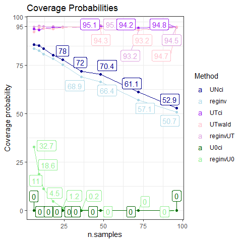
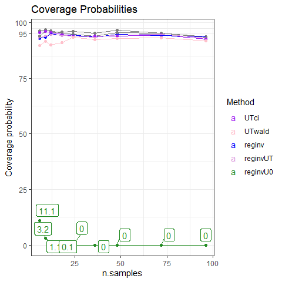

Simulation Results
================
Victor Tsang and David Warton
15 July, 2023

- <a href="#tldr" id="toc-tldr">TL;DR</a>
- <a href="#point-estimates" id="toc-point-estimates">Point Estimates</a>
  - <a href="#plots" id="toc-plots">Plots</a>
  - <a href="#commentary" id="toc-commentary">Commentary</a>
- <a href="#confidence-intervals" id="toc-confidence-intervals">Confidence
  Intervals</a>
  - <a href="#coverage-probability" id="toc-coverage-probability">Coverage
    Probability</a>
  - <a href="#widths" id="toc-widths">Widths</a>
  - <a href="#runtime" id="toc-runtime">Runtime</a>
  - <a href="#commentary-1" id="toc-commentary-1">Commentary</a>

# TL;DR

- MINMI point estimates aren’t as accurate as MLE under Uniform-Normal
  (UN) model
- MINMI point estimates appear to be more biased than MLE
- main issue is that MINMI has much higher sample variance - and not
  decreasing with sample size!!
- The issue here is that sample minimum is not a good statistic for
  measurement error scenarios :(
- Coverage probability of MINMI and MLE_INV is good, asymptotic MLE is
  good except at low sample size and low measurement error

#### Which value of `error_factor` do we want plots for?

``` r
error_fac_to_plot = 1 #change this value to look at plots for a different error_factor
```

------------------------------------------------------------------------

#### Load in the results

``` r
library(knitr)
library(tidyverse)
library(scales)
library(ggrepel)
library(gridExtra)
library(latex2exp)


load("data/synthetic-data.RData")
attach(synthetic.data.config)

RESULTS_PATH <- 'data/simResults-12-20230714.RData'
load(RESULTS_PATH)

head(results)
```

    ##   which_sim n.samples error_factor  method    lower    point    upper
    ## 1         1        12            0   MINMI 13257.14 14746.78 15031.15
    ## 2         1        12            0    UNci 14180.94 15041.62 15041.62
    ## 3         1        12            0  UNwald 15041.62 15041.62 15041.62
    ## 4         1        12            0  mleInv 13375.58 15041.62 15029.42
    ## 5         1        12            0 mleInv2 13250.71 15041.62 15019.78
    ## 6         1        12            0 mleInvP 13460.66 15041.62 15025.35
    ##   point_runtime conf_int_runtime B.lower B.point B.upper
    ## 1  6.060600e-04       0.00060606      NA      NA      NA
    ## 2            NA       0.06055045     100     100     100
    ## 3  0.000000e+00       0.01260281     100     100     100
    ## 4  3.504753e-05       5.38803411     100     100     100
    ## 5  3.528595e-05       3.97615123     100     100     100
    ## 6  3.004074e-05       5.34543920     100     100     100

``` r
all_results=results
all_results$n.samples = synthetic.data.config$n.samples
all_results=all_results[0,]

n.samples=c(12,24,36,48,60)
#n.samples=c(12,24,36,48)
for (iSample in 1:length(n.samples))
{
  RESULTS_PATH <- paste0("data/simResults-",n.samples[iSample],"-20230714.RData")
  load(RESULTS_PATH)
  all_results=tibble::add_row(
      all_results,
      error_factor = results$error_factor,
      method=results$method,
      lower=results$lower,
      point=results$point,
      upper=results$upper,
      point_runtime=results$point_runtime,
      conf_int_runtime=results$conf_int_runtime,
      B.lower=results$B.lower,
      B.point=results$B.point,
      B.upper=results$B.upper,
      n.samples=n.samples[iSample]
  )
}
```

``` r
all_results %>%
  group_by(method, error_factor, n.samples) %>%
  summarise(point.pct_na = mean(point,na.rm=TRUE),
            lower.pct_na = mean(lower,na.rm=TRUE),
            upper.pct_na = mean(upper,na.rm=TRUE))
```

    ## `summarise()` has grouped output by 'method', 'error_factor'. You can override
    ## using the `.groups` argument.

    ## # A tibble: 175 × 6
    ## # Groups:   method, error_factor [35]
    ##    method error_factor n.samples point.pct_na lower.pct_na upper.pct_na
    ##    <chr>         <dbl>     <dbl>        <dbl>        <dbl>        <dbl>
    ##  1 MINMI           0          12       15101.       13711.       15366.
    ##  2 MINMI           0          24       15047.       14389.       15183.
    ##  3 MINMI           0          36       15039.       14608.       15130.
    ##  4 MINMI           0          48       15028.       14708.       15097.
    ##  5 MINMI           0          60       15027.       14773.       15082.
    ##  6 MINMI           0.5        12       15106.       13716.       15536.
    ##  7 MINMI           0.5        24       15021.       14341.       15392.
    ##  8 MINMI           0.5        36       15006.       14537.       15499.
    ##  9 MINMI           0.5        48       14978.       14604.       15473.
    ## 10 MINMI           0.5        60       14989.       14678.       15465.
    ## # … with 165 more rows

# Point Estimates

#### Calculate Metrics

``` r
performance.point <- all_results %>%
  filter(!is.na(point)) %>% filter(error_factor == error_fac_to_plot) %>%
  group_by(method, n.samples) %>%
  summarise(MSE_000 = mean((point - theta.true)^2,na.rm=TRUE)/1000,
            bias = mean(point,na.rm=TRUE)-theta.true,
            variance_000 = var(point,na.rm=TRUE)/1000,
            avg_runtime = round(mean(point_runtime,na.rm=TRUE), 5))
```

    ## `summarise()` has grouped output by 'method'. You can override using the
    ## `.groups` argument.

``` r
performance.point.tbl = vector(mode = "list", length(n.samples))

for (i in 1:length(n.samples)) {
  performance.point.tbl[[i]] <- performance.point %>%
    filter(n.samples == n.samples[i]) %>%
    ungroup() %>%
    mutate(across(!c(method, n.samples, avg_runtime), round)) %>%
    mutate(avg_runtime = round(avg_runtime, digits = 5)) %>%
    arrange(MSE_000)
}

performance.point.tbl[[1]]
```

    ## # A tibble: 7 × 6
    ##   method  n.samples MSE_000  bias variance_000 avg_runtime
    ##   <chr>       <dbl>   <dbl> <dbl>        <dbl>       <dbl>
    ## 1 MINMI          12     229    83          223      0.0306
    ## 2 mleInv         12     257   234          203      0.0120
    ## 3 mleInv2        12     257   234          203      0.0120
    ## 4 mleInvP        12     257   234          203      0.0120
    ## 5 mleInvW        12     257   234          203      0.0120
    ## 6 UNci           12     257   234          203    NaN     
    ## 7 UNwald         12     257   234          203    296.

``` r
performance.point.tbl[[2]]
```

    ## # A tibble: 7 × 6
    ##   method  n.samples MSE_000  bias variance_000 avg_runtime
    ##   <chr>       <dbl>   <dbl> <dbl>        <dbl>       <dbl>
    ## 1 mleInv         24      90   111           78      0.0239
    ## 2 mleInv2        24      90   111           78      0.0235
    ## 3 mleInvP        24      90   111           78      0.0233
    ## 4 mleInvW        24      90   111           78      0.0232
    ## 5 UNci           24      90   111           78    NaN     
    ## 6 UNwald         24      90   111           78    228.    
    ## 7 MINMI          24     116     1          116      0.0592

``` r
performance.point.tbl[[3]]
```

    ## # A tibble: 7 × 6
    ##   method  n.samples MSE_000  bias variance_000 avg_runtime
    ##   <chr>       <dbl>   <dbl> <dbl>        <dbl>       <dbl>
    ## 1 mleInv         36      53    82           47      0.0348
    ## 2 mleInv2        36      53    82           47      0.0340
    ## 3 mleInvP        36      53    82           47      0.0344
    ## 4 mleInvW        36      53    82           47      0.0342
    ## 5 UNci           36      53    82           47    NaN     
    ## 6 UNwald         36      53    82           47    181.    
    ## 7 MINMI          36     146   -56          143      0.0862

Ignore run-times - I used that to store SEs for UN

#### Pivot to make plots and filter to `error_factor`

``` r
performance.point.long <- performance.point %>%
  rename(Method = method, n.samples = n.samples, Bias = bias, Var_000 = variance_000, Runtime = avg_runtime) %>%
  pivot_longer(cols=c(MSE_000, Bias, Var_000, Runtime), names_to = "Metric")
  
performance.point.long
```

    ## # A tibble: 140 × 4
    ## # Groups:   Method [7]
    ##    Method n.samples Metric     value
    ##    <chr>      <dbl> <chr>      <dbl>
    ##  1 MINMI         12 MSE_000 229.    
    ##  2 MINMI         12 Bias     82.9   
    ##  3 MINMI         12 Var_000 223.    
    ##  4 MINMI         12 Runtime   0.0306
    ##  5 MINMI         24 MSE_000 116.    
    ##  6 MINMI         24 Bias      1.42  
    ##  7 MINMI         24 Var_000 116.    
    ##  8 MINMI         24 Runtime   0.0592
    ##  9 MINMI         36 MSE_000 146.    
    ## 10 MINMI         36 Bias    -55.9   
    ## # … with 130 more rows

### Plots

``` r
metrics = unique(performance.point.long$Metric)
performance.point_estimates.plots = lapply(metrics,
  function(met) {
    p = ggplot(data = filter(performance.point.long, Metric == met),
               mapping = aes(x = n.samples, y = value, colour = reorder(Method, value, decreasing=T))) +
      geom_line() +
      geom_point() +
      theme_bw() +
      labs(title = paste(met, "by Error"), ylab=NULL, colour = "Method") +
      theme(rect = element_rect(fill = "transparent")) +
      scale_color_manual(values = c("MINMI" = "#00BA38",
                                    "MLE" = "#619CFF",
                                    "BA-MLE" = "purple",
                                    "Strauss" = "orange",
                                    "GRIWM-corrected" = "darkgray",
                                    "GRIWM" = "maroon",
                                    "UNci" = "darkblue",
                                    "UNwald" = "red",
                                    "mleInv" = "purple",
                                    "mleInv2" = "plum",
                                    "mleInvP"="orchid",
                                    "mleInvW" = "pink"))
    
    if (met %in% c("MSE", "Runtime")) {
      p = p+scale_y_log10(labels = label_comma())
    }
    p
  }
)

performance.point_estimates.plots[[1]] = performance.point_estimates.plots[[1]] + ylab("000's")
performance.point_estimates.plots[[2]] = performance.point_estimates.plots[[2]] + ylab("Years")
performance.point_estimates.plots[[3]] = performance.point_estimates.plots[[3]] + ylab("000's")

performance.point_estimates.plots[[1]]
```

<!-- -->

``` r
performance.point_estimates.plots[[2]]
```

<!-- -->

``` r
performance.point_estimates.plots[[3]]
```

<!-- -->

## Commentary

1.  MSE:
    1.  MINMI has much higher MSE than UN-MLE
    2.  MINMI MSE does not decrease as sample size increases (for large
        n)
2.  Bias:
    1.  MINMI is more biased than UN (mean vs median thing I guess)
3.  Variance:
    1.  MINMI estimates generally have more variance than UN, and not
        decreasing with sample size (for large n)

``` r
performance.point_estimates.plot.grid = do.call(grid.arrange, performance.point_estimates.plots)
```

    ## Warning: Removed 5 row(s) containing missing values (geom_path).

    ## Warning: Removed 5 rows containing missing values (geom_point).

<!-- -->

``` r
performance.point_estimates.plot.grid
```

    ## TableGrob (2 x 2) "arrange": 4 grobs
    ##   z     cells    name           grob
    ## 1 1 (1-1,1-1) arrange gtable[layout]
    ## 2 2 (1-1,2-2) arrange gtable[layout]
    ## 3 3 (2-2,1-1) arrange gtable[layout]
    ## 4 4 (2-2,2-2) arrange gtable[layout]

# Confidence Intervals

#### Calculate Metrics and Pivot

``` r
performance.CI <- all_results %>%
  filter(!is.na(conf_int_runtime)) %>% filter(error_factor == error_fac_to_plot) %>%
  mutate(width = upper - lower,
         contains_theta = ifelse(theta.true > lower & theta.true < upper, 1, 0)) %>%
  group_by(n.samples, method) %>%
  summarise(Coverage = round(mean(contains_theta, na.rm=TRUE) * 100, 1),
            `Average Width` = round(mean(width, na.rm=TRUE), 2),
            `Average Runtime` = round(mean(conf_int_runtime, na.rm=TRUE), 5)) %>%
  ungroup() %>%
  arrange(method, n.samples)
```

    ## `summarise()` has grouped output by 'n.samples'. You can override using the
    ## `.groups` argument.

``` r
performance.CI.long <- performance.CI %>%
  rename(n.samples = n.samples, Method = method, Width = `Average Width`, Runtime = `Average Runtime`) %>%
  pivot_longer(cols=c(Coverage, Width, Runtime),
               names_to = "Metric")
  
performance.CI.long
```

    ## # A tibble: 105 × 4
    ##    n.samples Method Metric       value
    ##        <dbl> <chr>  <chr>        <dbl>
    ##  1        12 MINMI  Coverage   94.8   
    ##  2        12 MINMI  Width    2116.    
    ##  3        12 MINMI  Runtime     0.0306
    ##  4        24 MINMI  Coverage   94.2   
    ##  5        24 MINMI  Width    1456.    
    ##  6        24 MINMI  Runtime     0.0592
    ##  7        36 MINMI  Coverage   95.5   
    ##  8        36 MINMI  Width    1676.    
    ##  9        36 MINMI  Runtime     0.0862
    ## 10        48 MINMI  Coverage   94.8   
    ## # … with 95 more rows

## Coverage Probability

``` r
conf_int.coverage.plot <- performance.CI.long %>%
  filter(Metric == "Coverage") %>%
  ggplot(aes(x=n.samples, y=value, colour=reorder(Method, value, decreasing=T))) +
  geom_point() +
  geom_line(linewidth=0.5) +
  geom_label_repel(aes(label = value)) +
  theme_bw() +
  labs(y = "Coverage probability", colour="Method", title="Coverage Probabilities") +
  scale_y_continuous(breaks=c(0, 25, 50, 75, 95, 100)) +
  theme(rect = element_rect(fill = "transparent")) +
  scale_color_manual(values = c("GRIWM" = "#F8766D", "GRIWM-corrected" = "#619CFF", "MINMI" = "#00BA38", "UNci" = "darkblue", "UNwald" = "red",
                                    "mleInv" = "purple",
                                    "mleInv2" = "plum",
                                    "mleInvP"="orchid",
                                    "mleInvW" = "pink"))
```

    ## Warning: Ignoring unknown parameters: linewidth

``` r
conf_int.coverage.plot
```

<!-- -->

## Widths

``` r
conf_int.width.plot <- performance.CI.long %>%
  filter(Metric == "Width") %>%
  ggplot(aes(x=n.samples, y=value, colour=reorder(Method, value, decreasing=T))) +
  geom_point() +
  geom_line(linewidth=0.5) +
  theme_bw() +
  labs(y = "Years", colour="Method", title="Average Width of Estimated Confidence Intervals") +
  theme(rect = element_rect(fill = "transparent")) +
  scale_color_manual(values = c("GRIWM" = "#F8766D", "GRIWM-corrected" = "#619CFF", "MINMI" = "#00BA38", "UNci"="darkblue", "UNwald" = "red",
                                    "mleInv" = "purple",
                                    "mleInv2" = "plum",
                                    "mleInvP"="orchid",
                                    "mleInvW" = "pink"))
```

    ## Warning: Ignoring unknown parameters: linewidth

``` r
conf_int.width.plot
```

<!-- -->

## Runtime

``` r
conf_int.runtime.plot <- performance.CI.long %>%
  filter(Metric == "Runtime") %>%
  ggplot(aes(x=n.samples, y=value, colour=reorder(Method, value, decreasing=T))) +
  geom_point() +
  geom_line(linewidth=0.5) +
  theme_bw() +
  scale_y_continuous(trans=scales::log10_trans()) +
  labs(y = "Seconds", colour="Method", title="Average Runtime of Confidence Interval Estimation") +
  theme(rect = element_rect(fill = "transparent")) +
  scale_color_manual(values = c("GRIWM" = "#F8766D", "GRIWM-corrected" = "#619CFF", "MINMI" = "#00BA38", "UNci"="darkblue", "UNwald" = "red",
                                    "mleInv" = "purple",
                                    "mleInv2" = "plum",
                                    "mleInvP"="orchid",
                                    "mleInvW" = "pink"))
```

    ## Warning: Ignoring unknown parameters: linewidth

``` r
conf_int.runtime.plot
```

<!-- -->

## Commentary

1.  Coverage Probability:
    1.  MINMI generally has good coverage probability, as does MLE-INV
    2.  Asymptotic UN-MLE methods have good coverage at moderate-large
        sample sizes (but not for small n)
    3.  UN-Wald is slower to converge to desired coverage probability
        (symmetric CI)
2.  Confidence Interval Widths:
    1.  MINMI has way wider CIs
    2.  MINMI CI width does not decrease as sample size increases
3.  Runtime
    1.  MLE_INV takes ages, MINMI a bit longer(!) Although I was using
        B=100, might have been fairer to compare at B=100 instead of
        doing choose B first

#### Extra bonus: is the sampling distribution of MLE Gaussian for ?

``` r
errors=unique(results$error_factor)
nError=length(errors)
par(mfrow=c(5,3),mgp=c(1.75,0.75,0),mar=c(3,2,0,0),oma=c(0,2,2,0))
for(iError in 1:nError)
{
  tmp=results%>%filter(method=="UNci" & error_factor==errors[iError]) %>% select(lower,point,upper)
  hist(tmp$lower,xlab="theta_lower",ylab="",main="")
  mtext(paste0("error_fac=",errors[iError]),2,line=2,font=2,cex=0.8)
  if(iError==1)
    mtext("theta_lower",3,font=2,cex=0.8)
  hist(tmp$point,xlab="theta_hat",ylab="",main="")
  if(iError==1)
    mtext("theta_hat",3,font=2)
  hist(tmp$point,xlab="theta_upper",ylab="",main="")
  if(iError==1)
    mtext("theta_upper",3,font=2)
}
```

<!-- -->

Um, yes! Not at , as expected, because this is a sample minimum.

Quantiles also seem to be approx normal with no outliers (except at
where it looks like there is some non-convergence).

#### How good are standard error estimates?

``` r
errors=unique(results$error_factor)
nError=length(errors)
par(mfrow=c(3,2),mgp=c(1.75,0.75,0),mar=c(3,2,0,0),oma=c(0,2,2,0))
for(iError in 1:nError)
{
  tmp=results%>%filter(method=="UNwald" & error_factor==errors[iError]) %>% select(point,point_runtime)
  nError=length(errors)
  hist(tmp$point_runtime,xlab="SE",ylab="",main="")
  mtext(paste0("error_fac=",errors[iError]),2,line=2,font=2,cex=0.8)
  abline(v=sd(tmp$point),col="red")
}
```

<!-- -->
