Simulation Results
================
Victor Tsang
<<<<<<< Updated upstream
16 June, 2023
=======
26 July, 2023
>>>>>>> Stashed changes

- <a href="#tldr" id="toc-tldr">TL;DR</a>
- <a href="#point-estimates" id="toc-point-estimates">Point Estimates</a>
  - <a href="#plots" id="toc-plots">Plots</a>
  - <a href="#commentary" id="toc-commentary">Commentary</a>
- <a href="#confidence-intervals" id="toc-confidence-intervals">Confidence
  Intervals</a>
  - <a href="#coverage-probability" id="toc-coverage-probability">Coverage
    Probability</a>
  - <a href="#widths" id="toc-widths">Widths</a>
  - <a href="#runtime" id="toc-runtime">Runtime</a>
  - <a href="#commentary-1" id="toc-commentary-1">Commentary</a>

# TL;DR

- MINMI point estimates aren’t as accurate as other methods (MLE,
  BA-MLE, Strauss) in high measurement error variation scenarios.
  Possibly due to
  ?
- MINMI point estimates appear to be more biased and also more variable
  under both
  
  and
  
  models.
- As expected, MINMI is much faster than GRIWM.
- Coverage probability of MINMI is lower than expected in a the
  
  scenario. Again, possibly related to
  ,
  but unsure.

------------------------------------------------------------------------

#### Load in the results

``` r
library(knitr)
library(tidyverse)
library(scales)
library(ggrepel)
library(gridExtra)
library(latex2exp)


load("data/synthetic-data.RData")
attach(synthetic.data.config)

<<<<<<< Updated upstream
RESULTS_PATH <- 'data/simResults-100-20230616.RData'
=======
RESULTS_PATH <- 'data/simResults-sdFit-48-20230725.RData'
>>>>>>> Stashed changes
load(RESULTS_PATH)

head(results)
```

<<<<<<< Updated upstream
    ##   error_factor method    lower    point    upper point_runtime conf_int_runtime
    ## 1          0.0  MINMI 14830.29 14982.86 15016.26  7.891655e-05     7.891655e-05
    ## 2          0.0   UNci 14920.89 15017.52 15017.52            NA     5.306005e-02
    ## 3          0.0 UNwald 15017.52 15017.52 15017.52  0.000000e+00     7.192850e-03
    ## 4          0.5  MINMI 14833.54 15074.69 15630.77  1.979718e-01     1.979718e-01
    ## 5          0.5   UNci 14861.38 15026.43 15134.66            NA     1.551909e-01
    ## 6          0.5 UNwald 14899.04 15026.44 15153.83  6.499868e+01     6.108403e-02
    ##   B.lower B.point B.upper
    ## 1      NA      NA      NA
    ## 2     100     100     100
    ## 3     100     100     100
    ## 4     100     100     100
    ## 5     100     100     100
    ## 6     100     100     100
=======
    ##   which_sim n.samples error_factor  method    lower    point    upper
    ## 1         1        48            0   MINMI 14612.72 14938.67 15008.60
    ## 2         1        48            0    UNci 14807.56 15011.23 15011.23
    ## 3         1        48            0  UNwald 15011.23 15011.23 15011.23
    ## 4         1        48            0  mleInv 14643.79 15011.23 15009.02
    ## 5         1        48            0 mleInvP 14991.34 15011.23 14971.79
    ## 6         1        48            0 mleInvW 14596.66 15011.23 15003.58
    ##   point_runtime conf_int_runtime B.lower B.point B.upper
    ## 1  8.249283e-05     8.249283e-05      NA      NA      NA
    ## 2            NA     4.850149e-03     100     100     100
    ## 3  0.000000e+00     6.294250e-05     100     100     100
    ## 4  2.574921e-05     2.905069e+00     100     100     100
    ## 5  2.169609e-05     1.702976e-01     100     100     100
    ## 6  2.098083e-05     2.105674e+00     100     100     100
>>>>>>> Stashed changes

``` r
results %>%
  group_by(method, error_factor) %>%
  summarise(point.pct_na = mean(point,na.rm=TRUE),
            lower.pct_na = mean(lower,na.rm=TRUE),
            upper.pct_na = mean(upper,na.rm=TRUE))
```

    ## `summarise()` has grouped output by 'method'. You can override using the
    ## `.groups` argument.

<<<<<<< Updated upstream
    ## # A tibble: 15 × 5
    ## # Groups:   method [3]
    ##    method error_factor point.pct_na lower.pct_na upper.pct_na
    ##    <chr>         <dbl>        <dbl>        <dbl>        <dbl>
    ##  1 MINMI           0         15014.       14863.       15048.
    ##  2 MINMI           0.5       14957.       14714.       15515.
    ##  3 MINMI           1         14896.       14451.       16054.
    ##  4 MINMI           2         14813.       13867.       17268.
    ##  5 MINMI           4         14756.       12663.       21001.
    ##  6 UNci            0         15049.       14953.       15049.
    ##  7 UNci            0.5       15032.       14833.       15154.
    ##  8 UNci            1         15032.       14774.       15208.
    ##  9 UNci            2         15024.       14680.       15281.
    ## 10 UNci            4         15009.       14537.       15425.
    ## 11 UNwald          0         15049.       15049.       15049.
    ## 12 UNwald          0.5       15032.       14883.       15182.
    ## 13 UNwald          1         15032.       14824.       15240.
    ## 14 UNwald          2         15024.       14732.       15317.
    ## 15 UNwald          4         15009.       14611.       15461.
=======
    ## # A tibble: 30 × 5
    ## # Groups:   method [6]
    ##    method error_factor point.pct_na lower.pct_na upper.pct_na
    ##    <chr>         <dbl>        <dbl>        <dbl>        <dbl>
    ##  1 MINMI           0         15025.       14705.       15094.
    ##  2 MINMI           0.5       15015.       14645.       15289.
    ##  3 MINMI           1         15013.       14520.       15492.
    ##  4 MINMI           2         14979.       14213.       15846.
    ##  5 MINMI           4         14824.       13509.       16449.
    ##  6 mleInv          0         15097.       14709.       15094.
    ##  7 mleInv          0.5       15039.       14664.       15241.
    ##  8 mleInv          1         15034.       14469.       15241.
    ##  9 mleInv          2         14979.       13997.       15113.
    ## 10 mleInv          4         14766.       12944.       14691.
    ## # … with 20 more rows
>>>>>>> Stashed changes

# Point Estimates

#### Calculate Metrics

``` r
performance.point <- results %>%
  filter(!is.na(point)) %>%
  group_by(error_factor, method) %>%
  summarise(MSE_000 = mean((point - theta.true)^2,na.rm=TRUE)/1000,
            bias = mean(point,na.rm=TRUE)-theta.true,
            variance_000 = var(point,na.rm=TRUE)/1000,
            avg_runtime = round(mean(point_runtime,na.rm=TRUE), 5))
```

    ## `summarise()` has grouped output by 'error_factor'. You can override using the
    ## `.groups` argument.

``` r
performance.point.tbl = vector(mode = "list", length(error_factors))

for (i in 1:length(error_factors)) {
  performance.point.tbl[[i]] <- performance.point %>%
    filter(error_factor == error_factors[i]) %>%
    ungroup() %>%
    mutate(across(!c(error_factor, method, avg_runtime), round)) %>%
    mutate(avg_runtime = round(avg_runtime, digits = 5)) %>%
    arrange(MSE_000)
}

performance.point.tbl[[1]]
```

<<<<<<< Updated upstream
    ## # A tibble: 3 × 6
    ##   error_factor method MSE_000  bias variance_000 avg_runtime
    ##          <dbl> <chr>    <dbl> <dbl>        <dbl>       <dbl>
    ## 1            0 MINMI        3    14            2     0.00018
    ## 2            0 UNci         5    49            2   NaN      
    ## 3            0 UNwald       5    49            2     0
=======
    ## # A tibble: 6 × 6
    ##   error_factor method  MSE_000  bias variance_000 avg_runtime
    ##          <dbl> <chr>     <dbl> <dbl>        <dbl>       <dbl>
    ## 1            0 MINMI         9    25            8     0.00008
    ## 2            0 mleInv       17    97            8     0.00003
    ## 3            0 mleInvP      17    97            8     0.00003
    ## 4            0 mleInvW      17    97            8     0.00003
    ## 5            0 UNci         17    97            8   NaN      
    ## 6            0 UNwald       17    97            8     0
>>>>>>> Stashed changes

``` r
performance.point.tbl[[2]]
```

<<<<<<< Updated upstream
    ## # A tibble: 3 × 6
    ##   error_factor method MSE_000  bias variance_000 avg_runtime
    ##          <dbl> <chr>    <dbl> <dbl>        <dbl>       <dbl>
    ## 1          0.5 UNci         9    32            8     NaN    
    ## 2          0.5 UNwald       9    32            8      76.3  
    ## 3          0.5 MINMI       47   -43           45       0.533
=======
    ## # A tibble: 6 × 6
    ##   error_factor method  MSE_000  bias variance_000 avg_runtime
    ##          <dbl> <chr>     <dbl> <dbl>        <dbl>       <dbl>
    ## 1          0.5 mleInv       23    39           22      0.0409
    ## 2          0.5 mleInvP      23    39           22      0.0399
    ## 3          0.5 mleInvW      23    39           22      0.0398
    ## 4          0.5 UNci         23    39           22    NaN     
    ## 5          0.5 UNwald       23    39           22    121.    
    ## 6          0.5 MINMI        25    15           25      0.114
>>>>>>> Stashed changes

``` r
performance.point.tbl[[3]]
```

<<<<<<< Updated upstream
    ## # A tibble: 3 × 6
    ##   error_factor method MSE_000  bias variance_000 avg_runtime
    ##          <dbl> <chr>    <dbl> <dbl>        <dbl>       <dbl>
    ## 1            1 UNci        15    32           14     NaN    
    ## 2            1 UNwald      15    32           14     106.   
    ## 3            1 MINMI      198  -104          187       0.559
=======
    ## # A tibble: 6 × 6
    ##   error_factor method  MSE_000  bias variance_000 avg_runtime
    ##          <dbl> <chr>     <dbl> <dbl>        <dbl>       <dbl>
    ## 1            1 mleInv       37    34           35      0.0390
    ## 2            1 mleInvP      37    34           35      0.0389
    ## 3            1 mleInvW      37    34           35      0.0391
    ## 4            1 UNci         37    34           35    NaN     
    ## 5            1 UNwald       37    34           35    178.    
    ## 6            1 MINMI        55    13           55      0.107
>>>>>>> Stashed changes

``` r
performance.point.tbl[[4]]
```

<<<<<<< Updated upstream
    ## # A tibble: 3 × 6
    ##   error_factor method MSE_000  bias variance_000 avg_runtime
    ##          <dbl> <chr>    <dbl> <dbl>        <dbl>       <dbl>
    ## 1            2 UNci        25    24           24     NaN    
    ## 2            2 UNwald      25    24           24     149.   
    ## 3            2 MINMI      894  -187          860       0.586
=======
    ## # A tibble: 6 × 6
    ##   error_factor method  MSE_000  bias variance_000 avg_runtime
    ##          <dbl> <chr>     <dbl> <dbl>        <dbl>       <dbl>
    ## 1            2 mleInv       75   -21           74      0.0400
    ## 2            2 mleInvP      75   -21           74      0.0394
    ## 3            2 mleInvW      75   -21           74      0.0401
    ## 4            2 UNci         75   -21           74    NaN     
    ## 5            2 UNwald       75   -21           74    261.    
    ## 6            2 MINMI       146   -21          146      0.112
>>>>>>> Stashed changes

``` r
performance.point.tbl[[5]]
```

<<<<<<< Updated upstream
    ## # A tibble: 3 × 6
    ##   error_factor method MSE_000  bias variance_000 avg_runtime
    ##          <dbl> <chr>    <dbl> <dbl>        <dbl>       <dbl>
    ## 1            4 UNci       171     9          171     NaN    
    ## 2            4 UNwald     171     9          171     217.   
    ## 3            4 MINMI     3280  -244         3223       0.634
=======
    ## # A tibble: 6 × 6
    ##   error_factor method  MSE_000  bias variance_000 avg_runtime
    ##          <dbl> <chr>     <dbl> <dbl>        <dbl>       <dbl>
    ## 1            4 mleInvP     211  -234          157      0.0364
    ## 2            4 UNci        211  -234          156    NaN     
    ## 3            4 mleInv      212  -234          157      0.0366
    ## 4            4 mleInvW     212  -234          157      0.0367
    ## 5            4 UNwald      212  -234          157    391.    
    ## 6            4 MINMI       522  -176          492      0.123
>>>>>>> Stashed changes

#### Pivot to make plots

``` r
performance.point.long <- performance.point %>%
  rename(Error = error_factor, Method = method, Bias = bias, Var_000 = variance_000, Runtime = avg_runtime) %>%
  pivot_longer(cols=c(MSE_000, Bias, Var_000, Runtime), names_to = "Metric")
  
performance.point.long
```

<<<<<<< Updated upstream
    ## # A tibble: 60 × 4
    ## # Groups:   Error [5]
    ##    Error Method Metric      value
    ##    <dbl> <chr>  <chr>       <dbl>
    ##  1     0 MINMI  MSE_000   2.58   
    ##  2     0 MINMI  Bias     14.3    
    ##  3     0 MINMI  Var_000   2.37   
    ##  4     0 MINMI  Runtime   0.00018
    ##  5     0 UNci   MSE_000   4.72   
    ##  6     0 UNci   Bias     48.8    
    ##  7     0 UNci   Var_000   2.34   
    ##  8     0 UNci   Runtime NaN      
    ##  9     0 UNwald MSE_000   4.72   
    ## 10     0 UNwald Bias     48.8    
    ## # … with 50 more rows
=======
    ## # A tibble: 120 × 4
    ## # Groups:   Error [5]
    ##    Error Method  Metric     value
    ##    <dbl> <chr>   <chr>      <dbl>
    ##  1     0 MINMI   MSE_000  8.93   
    ##  2     0 MINMI   Bias    25.3    
    ##  3     0 MINMI   Var_000  8.29   
    ##  4     0 MINMI   Runtime  0.00008
    ##  5     0 mleInv  MSE_000 17.4    
    ##  6     0 mleInv  Bias    96.7    
    ##  7     0 mleInv  Var_000  8.06   
    ##  8     0 mleInv  Runtime  0.00003
    ##  9     0 mleInvP MSE_000 17.4    
    ## 10     0 mleInvP Bias    96.7    
    ## # … with 110 more rows
>>>>>>> Stashed changes

### Plots

``` r
metrics = unique(performance.point.long$Metric)
performance.point_estimates.plots = lapply(metrics,
  function(met) {
    p = ggplot(data = filter(performance.point.long, Metric == met),
               mapping = aes(x = Error, y = value, colour = reorder(Method, value, decreasing=T))) +
      geom_line() +
      geom_point() +
      theme_bw() +
      labs(title = paste(met, "by Error"), ylab=NULL, colour = "Method") +
      theme(rect = element_rect(fill = "transparent")) +
      scale_color_manual(values = c("MINMI" = "#00BA38",
                                    "MLE" = "#619CFF",
                                    "BA-MLE" = "purple",
                                    "Strauss" = "orange",
                                    "GRIWM-corrected" = "darkgray",
                                    "GRIWM" = "maroon",
<<<<<<< Updated upstream
                                    "UNci" = "darkblue"))
=======
                                    "UNci" = "darkblue",
                                    "UNwald" = "red",
                                    "mleInv" = "purple",
                                    "mleInv2" = "plum",
                                    "mleInvP"="orchid",
                                    "mleInvW" = "pink",
                                    "mleInvA1" = "brown"))
>>>>>>> Stashed changes
    
    if (met %in% c("MSE", "Runtime")) {
      p = p+scale_y_log10(labels = label_comma())
    }
    p
  }
)

performance.point_estimates.plots[[1]] = performance.point_estimates.plots[[1]] + ylab("000's")
performance.point_estimates.plots[[2]] = performance.point_estimates.plots[[2]] + ylab("Years")
performance.point_estimates.plots[[3]] = performance.point_estimates.plots[[3]] + ylab("000's")
performance.point_estimates.plots[[4]] = performance.point_estimates.plots[[4]] + ylab("Seconds")

performance.point_estimates.plots[[1]]
```

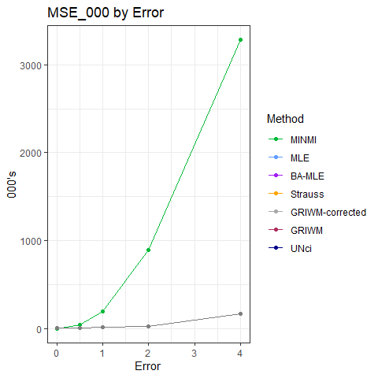<!-- -->

``` r
performance.point_estimates.plots[[2]]
```

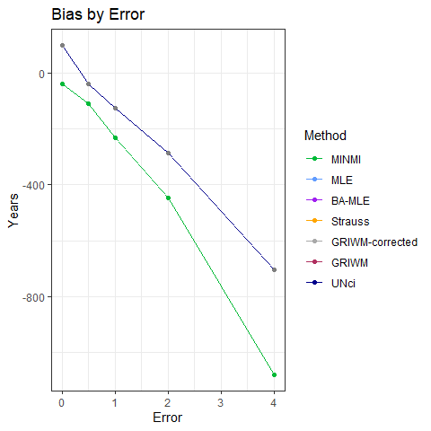<!-- -->

``` r
performance.point_estimates.plots[[3]]
```

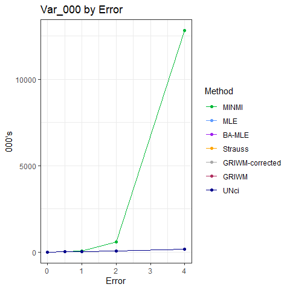<!-- -->

``` r
performance.point_estimates.plots[[4]]
```

    ## Warning: Transformation introduced infinite values in continuous y-axis
    ## Transformation introduced infinite values in continuous y-axis

    ## Warning: Removed 5 row(s) containing missing values (geom_path).

    ## Warning: Removed 5 rows containing missing values (geom_point).

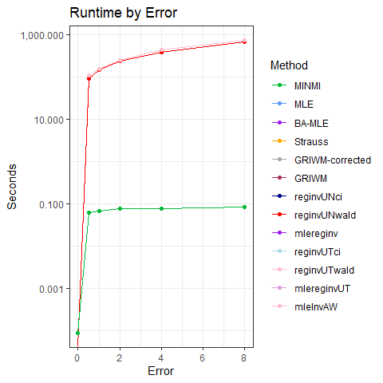<!-- -->

## Commentary

1.  MSE:
    1.  MINMI generally produces estimates with similar MSE to the MLE
    2.  MINMI had the worst MSE in
        
        scenarios and was moderately bad in the
        
        scenario
2.  Bias:
    1.  MINMI is more biased than everything else
    2.  For some reason, it’s substantially more negatively biased in
        the
        
        scenario. Possibly related to the
        ,
        meaning our measurement errors are negatively skewed, which
        “pull” our MINMI estimates downwards?
3.  Variance:
    1.  MINMI estimates generally have more variance than the other
        methods, likely due to it accounting for both sampling and
        measurement error.
    2.  **Question: Why do we have greater bias and greater variance?
        Seems counterintuitive considering that it’s common to see a
        bias-variance tradeoff.**
4.  Runtime:
    1.  
        model: MINMI is comparable to BA-MLE, Strauss, and MLE and is
        10,000 times faster than GRIWM.
    2.  In
        
        model: MINMI is faster than GRIWM by \~10x

``` r
performance.point_estimates.plot.grid = do.call(grid.arrange, performance.point_estimates.plots)
```

    ## Warning: Transformation introduced infinite values in continuous y-axis
    ## Transformation introduced infinite values in continuous y-axis

    ## Warning: Removed 5 row(s) containing missing values (geom_path).

    ## Warning: Removed 5 rows containing missing values (geom_point).

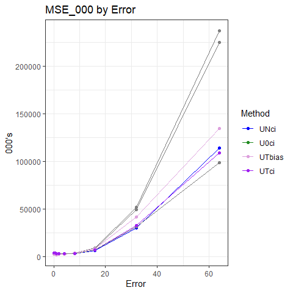<!-- -->

``` r
performance.point_estimates.plot.grid
```

    ## TableGrob (2 x 2) "arrange": 4 grobs
    ##   z     cells    name           grob
    ## 1 1 (1-1,1-1) arrange gtable[layout]
    ## 2 2 (1-1,2-2) arrange gtable[layout]
    ## 3 3 (2-2,1-1) arrange gtable[layout]
    ## 4 4 (2-2,2-2) arrange gtable[layout]

# Confidence Intervals

#### Calculate Metrics and Pivot

``` r
performance.CI <- results %>%
  filter(!is.na(conf_int_runtime)) %>%
  mutate(width = upper - lower,
         contains_theta = ifelse(theta.true > lower & theta.true < upper, 1, 0)) %>%
<<<<<<< Updated upstream
=======
#         contains_theta = ifelse(theta.true > lower, 1, 0)) %>%
#         contains_theta = ifelse(theta.true < upper, 1, 0)) %>%
>>>>>>> Stashed changes
  group_by(error_factor, method) %>%
  summarise(Coverage = round(mean(contains_theta, na.rm=TRUE) * 100, 1),
            `Average Width` = round(mean(width, na.rm=TRUE), 2),
            `Average Runtime` = round(mean(conf_int_runtime, na.rm=TRUE), 5)) %>%
  ungroup() %>%
  arrange(method, error_factor)
```

    ## `summarise()` has grouped output by 'error_factor'. You can override using the
    ## `.groups` argument.

``` r
performance.CI.long <- performance.CI %>%
  rename(Error = error_factor, Method = method, Width = `Average Width`, Runtime = `Average Runtime`) %>%
  pivot_longer(cols=c(Coverage, Width, Runtime),
               names_to = "Metric")
  
performance.CI.long
```

<<<<<<< Updated upstream
    ## # A tibble: 45 × 4
    ##    Error Method Metric        value
    ##    <dbl> <chr>  <chr>         <dbl>
    ##  1   0   MINMI  Coverage   94.3    
    ##  2   0   MINMI  Width     185.     
    ##  3   0   MINMI  Runtime     0.00018
    ##  4   0.5 MINMI  Coverage   94.2    
    ##  5   0.5 MINMI  Width     801.     
    ##  6   0.5 MINMI  Runtime     0.533  
    ##  7   1   MINMI  Coverage   94      
    ##  8   1   MINMI  Width    1603.     
    ##  9   1   MINMI  Runtime     0.559  
    ## 10   2   MINMI  Coverage   94.1    
    ## # … with 35 more rows
=======
    ## # A tibble: 90 × 4
    ##    Error Method Metric       value
    ##    <dbl> <chr>  <chr>        <dbl>
    ##  1   0   MINMI  Coverage  96.7    
    ##  2   0   MINMI  Width    389.     
    ##  3   0   MINMI  Runtime    0.00008
    ##  4   0.5 MINMI  Coverage  94      
    ##  5   0.5 MINMI  Width    644.     
    ##  6   0.5 MINMI  Runtime    0.114  
    ##  7   1   MINMI  Coverage  95.8    
    ##  8   1   MINMI  Width    972.     
    ##  9   1   MINMI  Runtime    0.107  
    ## 10   2   MINMI  Coverage  96.6    
    ## # … with 80 more rows
>>>>>>> Stashed changes

## Coverage Probability

``` r
conf_int.coverage.plot <- performance.CI.long %>%
  filter(Metric == "Coverage") %>%
  ggplot(aes(x=Error, y=value, colour=reorder(Method, value, decreasing=T))) +
  geom_point() +
  geom_line(linewidth=0.5) +
  geom_label_repel(aes(label = value)) +
  theme_bw() +
  labs(y = "Years", colour="Method", title="Coverage Probabilities") +
  scale_y_continuous(breaks=c(0, 25, 50, 75, 95, 100)) +
  theme(rect = element_rect(fill = "transparent")) +
<<<<<<< Updated upstream
  scale_color_manual(values = c("GRIWM" = "#F8766D", "GRIWM-corrected" = "#619CFF", "MINMI" = "#00BA38", "UNci" = "darkblue", "UNwald"="red"))
=======
  scale_color_manual(values = c("GRIWM" = "#F8766D", "GRIWM-corrected" = "#619CFF", "MINMI" = "#00BA38", "UNci" = "darkblue", "UNwald"="red","mleInv" = "purple","mleInv2"="plum","mleInvP"="orchid","mleInvW" = "pink",
                                    "mleInvA1" = "brown"))
>>>>>>> Stashed changes
```

    ## Warning: Ignoring unknown parameters: linewidth

``` r
conf_int.coverage.plot
```

<<<<<<< Updated upstream
=======
    ## Warning: ggrepel: 5 unlabeled data points (too many overlaps). Consider
    ## increasing max.overlaps

>>>>>>> Stashed changes
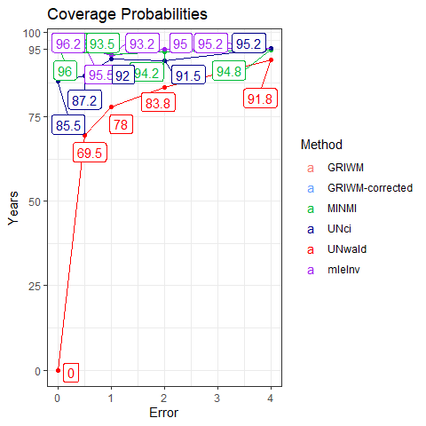<!-- -->

## Widths

``` r
conf_int.width.plot <- performance.CI.long %>%
  filter(Metric == "Width") %>%
  ggplot(aes(x=Error, y=value, colour=reorder(Method, value, decreasing=T))) +
  geom_point() +
  geom_line(linewidth=0.5) +
  theme_bw() +
  labs(y = "Years", colour="Method", title="Average Width of Estimated Confidence Intervals") +
  theme(rect = element_rect(fill = "transparent")) +
<<<<<<< Updated upstream
  scale_color_manual(values = c("GRIWM" = "#F8766D", "GRIWM-corrected" = "#619CFF", "MINMI" = "#00BA38", "UNci"="darkblue", "UNwald"="red"))
=======
  scale_color_manual(values = c("GRIWM" = "#F8766D", "GRIWM-corrected" = "#619CFF", "MINMI" = "#00BA38", "UNci"="darkblue", "UNwald"="red","mleInv" = "purple","mleInv2"="plum","mleInvP"="orchid","mleInvW" = "pink",
                                    "mleInvA1" = "brown"))
>>>>>>> Stashed changes
```

    ## Warning: Ignoring unknown parameters: linewidth

``` r
conf_int.width.plot
```

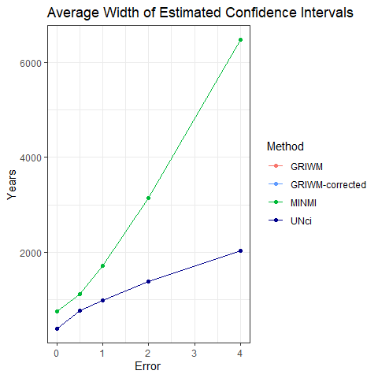<!-- -->

## Runtime

``` r
conf_int.runtime.plot <- performance.CI.long %>%
  filter(Metric == "Runtime") %>%
  ggplot(aes(x=Error, y=value, colour=reorder(Method, value, decreasing=T))) +
  geom_point() +
  geom_line(linewidth=0.5) +
  theme_bw() +
  scale_y_continuous(trans=scales::log10_trans()) +
  labs(y = "Seconds", colour="Method", title="Average Runtime of Confidence Interval Estimation") +
  theme(rect = element_rect(fill = "transparent")) +
<<<<<<< Updated upstream
  scale_color_manual(values = c("GRIWM" = "#F8766D", "GRIWM-corrected" = "#619CFF", "MINMI" = "#00BA38", "UNci"="darkblue", "UNwald"="red"))
=======
  scale_color_manual(values = c("GRIWM" = "#F8766D", "GRIWM-corrected" = "#619CFF", "MINMI" = "#00BA38", "UNci"="darkblue", "UNwald"="red","mleInv" = "purple","mleInv2"="plum","mleInvP"="orchid","mleInvW" = "pink",
                                    "mleInvA1" = "brown"))
>>>>>>> Stashed changes
```

    ## Warning: Ignoring unknown parameters: linewidth

``` r
conf_int.runtime.plot
```

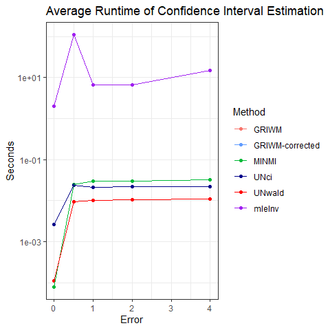<!-- -->

## Commentary

1.  Coverage Probability:
    1.  MINMI generally has better coverage probability than GRIWM
    2.  In
        
        scenario, MINMI’s coverage probability drops off — **why?!**.
        Possibly due to the negative skewed nature of the measurement
        errors
        ()?
2.  Confidence Interval Widths:
    1.  MINMI has consistently wider CI’s than GRIWM — it more
        accurately represents the uncertainty associated with our
        estimates, especially as measurement error gets large.
3.  Runtime
    1.  Similar to point estimates - MINMI consistently outperforms
        everything else.

#### Bonus: measurement error variation relative to our sampling error variation?

``` r
pct_sigma_sampling <- 4*fossil.sd / (K-theta.true)

tibble(index = 1:n.samples, pct_sigma_sampling) %>%
  mutate(label = ifelse(pct_sigma_sampling > 0.3, percent(pct_sigma_sampling), "")) %>%
  ggplot(aes(x=index, y=pct_sigma_sampling)) +
  geom_point() +
  geom_label_repel(aes(label=label)) + 
  labs(x = 'Sample Index', y = '% of K - theta', title="Measurement Error Variation Relative to Sample Error Variation", subtitle = "(4sigma scenario)") +
  scale_y_continuous(labels = percent_format())
```

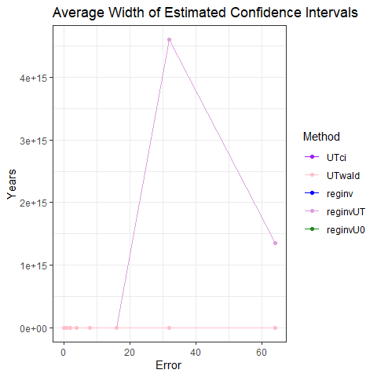<!-- -->

``` r
tibble(index = 1:n.samples, pct_sigma_sampling) %>%
  ggplot(aes(x=pct_sigma_sampling)) +
  geom_histogram(binwidth=0.05) +
  scale_x_continuous(labels = percent_format())
```

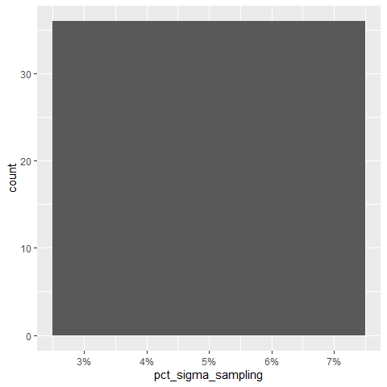<!-- -->

Under

scenario, we have a right skewed distribution. Our fossils are mostly
\<30% of
,
but we do get some samples with super large measurement error variation.
Perhaps these cause problems?

#### Extra bonus: is the sampling distribution of MLE Gaussian for ?

``` r
errors=unique(results$error_factor)
nError=length(errors)
par(mfrow=c(5,3),mgp=c(1.75,0.75,0),mar=c(3,2,0,0),oma=c(0,2,2,0))
for(iError in 1:nError)
{
  tmp=results%>%filter(method=="UNci" & error_factor==errors[iError]) %>% select(lower,point,upper)
  hist(tmp$lower,xlab="theta_lower",ylab="",main="")
  mtext(paste0("error_fac=",errors[iError]),2,line=2,font=2,cex=0.8)
  if(iError==1)
    mtext("theta_lower",3,font=2,cex=0.8)
  hist(tmp$point,xlab="theta_hat",ylab="",main="")
  if(iError==1)
    mtext("theta_hat",3,font=2)
  hist(tmp$point,xlab="theta_upper",ylab="",main="")
  if(iError==1)
    mtext("theta_upper",3,font=2)
}
```

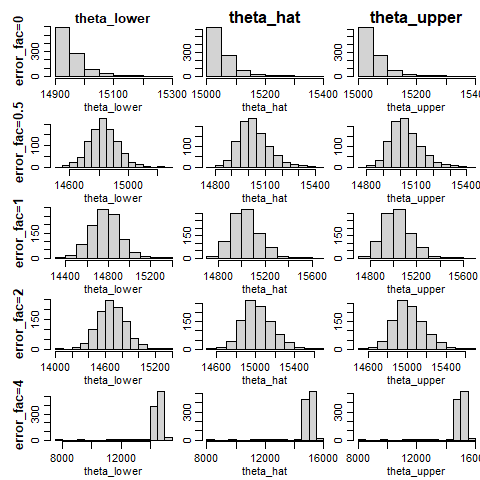<!-- -->

Um, yes! Not at , as expected, because this is a sample minimum.

Quantiles also seem to be approx normal with no outliers (except at
where it looks like there is some non-convergence).

#### How good are standard error estimates?

``` r
errors=unique(results$error_factor)
nError=length(errors)
par(mfrow=c(3,2),mgp=c(1.75,0.75,0),mar=c(3,2,0,0),oma=c(0,2,2,0))
for(iError in 1:nError)
{
  tmp=results%>%filter(method=="UNwald" & error_factor==errors[iError]) %>% select(point,point_runtime)
  nError=length(errors)
  hist(tmp$point_runtime,xlab="SE",ylab="",main="")
  abline(v=sd(tmp$point),col="red")
}
```

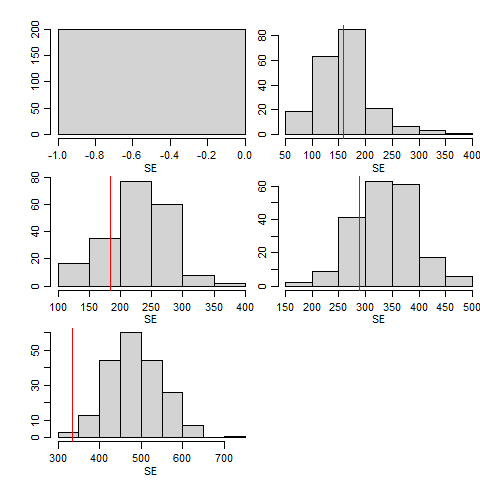<!-- -->
