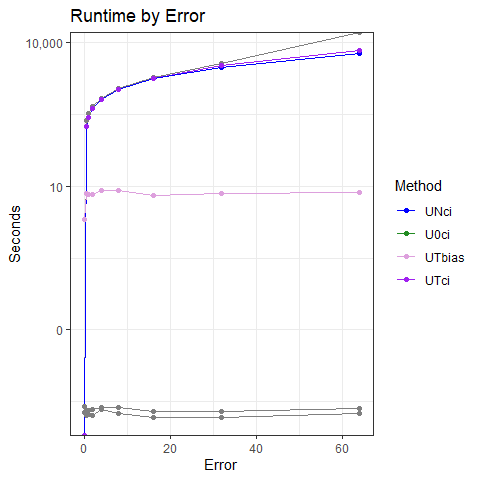
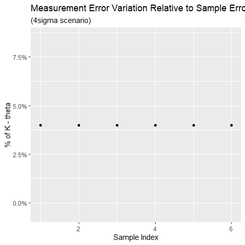
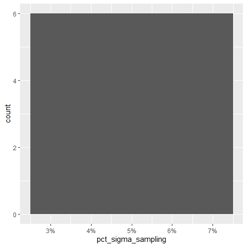
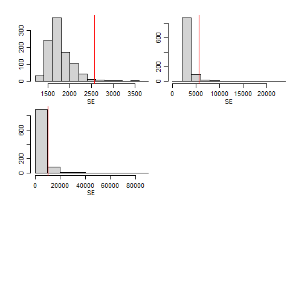

Simulation Results
================
David Warton and Victor Tsang
27 September, 2023

- <a href="#tldr" id="toc-tldr">TL;DR</a>
- <a href="#point-estimates" id="toc-point-estimates">Point Estimates</a>
  - <a href="#show-point-estimation-metrics-for-key-methods"
    id="toc-show-point-estimation-metrics-for-key-methods">Show point
    estimation metrics for key methods</a>
  - <a href="#plots" id="toc-plots">Plots</a>
  - <a href="#commentary" id="toc-commentary">Commentary</a>
- <a href="#confidence-intervals" id="toc-confidence-intervals">Confidence
  Intervals</a>
  - <a href="#show-ci-metrics-for-key-methods"
    id="toc-show-ci-metrics-for-key-methods">Show CI metrics for key
    methods</a>
  - <a href="#coverage-probability" id="toc-coverage-probability">Coverage
    Probability</a>
  - <a href="#widths" id="toc-widths">Widths</a>
  - <a href="#runtime" id="toc-runtime">Runtime</a>
  - <a href="#commentary-1" id="toc-commentary-1">Commentary</a>

# TL;DR

- MINMI point estimates aren’t as accurate as other methods (MLE) in
  high measurement error variation scenarios, because the minimum is not
  sufficient in the measurement error setting
- MINMI point estimates appear to be more biased in high measurement
  error settings and also more variable.
- As expected, MLE_INV is much slower than MINMI and asymptotic MLE
  approaches.
- Asymptotic MLE approaches have poor coverage probability when sample
  size and measurement error are both small, and as expected, MINMI and
  MLE_INV do fine on coverage.
- MINMI has wide confidence intervals when there is measurement error
  (because of inefficiency using minimum as statistic)

------------------------------------------------------------------------

#### Load in the results

``` r
library(knitr)
library(tidyverse)
library(scales)
library(ggrepel)
library(gridExtra)
library(latex2exp)


load("data/synthetic-data-6-20230901.RData")
attach(synthetic.data.config)

RESULTS_PATH <- 'data/simResults-6-20230926.RData'
load(RESULTS_PATH)

head(results)
```

    ##   which_sim n.samples error_factor  method    lower     point    upper
    ## 1         1         6            0  BA-MLE       NA  8728.782       NA
    ## 2         1         6            0 Strauss       NA  8521.504       NA
    ## 3         1         6            0   GRIWM 5517.000  5517.000  5517.00
    ## 4         1         6            0    U0ci 6693.891 10338.956 10338.96
    ## 5         1         6            0    UNci 6693.891 10338.956 10338.96
    ## 6         1         6            0    UTci 6693.891 10338.956 10338.96
    ##   point_runtime conf_int_runtime B.lower B.point B.upper
    ## 1  0.0001630783               NA      NA      NA      NA
    ## 2  0.0019938946               NA      NA      NA      NA
    ## 3  0.9487740993      0.948774099      NA      NA      NA
    ## 4  0.0000000000      0.003574848      NA      NA      NA
    ## 5  0.0000000000      0.001688957      NA      NA      NA
    ## 6  0.0000000000      0.001697302      NA      NA      NA

``` r
results %>%
  group_by(method, error_factor) %>%
  summarise(point.pct_na = mean(point,na.rm=TRUE),
            lower.pct_na = mean(lower,na.rm=TRUE),
            upper.pct_na = mean(upper,na.rm=TRUE))
```

    ## `summarise()` has grouped output by 'method'. You can override using the
    ## `.groups` argument.

    ## # A tibble: 117 × 5
    ## # Groups:   method [13]
    ##    method error_factor point.pct_na lower.pct_na upper.pct_na
    ##    <chr>         <dbl>        <dbl>        <dbl>        <dbl>
    ##  1 BA-MLE          0         10053.         NaN          NaN 
    ##  2 BA-MLE          0.5       10008.         NaN          NaN 
    ##  3 BA-MLE          1          9905.         NaN          NaN 
    ##  4 BA-MLE          2          9985.         NaN          NaN 
    ##  5 BA-MLE          4          9954.         NaN          NaN 
    ##  6 BA-MLE          8          9633.         NaN          NaN 
    ##  7 BA-MLE         16          8936.         NaN          NaN 
    ##  8 BA-MLE         32          6015.         NaN          NaN 
    ##  9 BA-MLE         64          -875.         NaN          NaN 
    ## 10 GRIWM           0          7219.        7219.        7219.
    ## # ℹ 107 more rows

# Point Estimates

#### Calculate Metrics

``` r
performance.point <- results %>%
  filter(!is.na(point),method%in%c("BA-MLE","Strauss","UNci","UT4ci","UTci","UTbias")) %>%
  group_by(error_factor, method) %>%
  summarise(MSE_000 = mean((point - theta.true)^2,na.rm=TRUE)/1000,
            bias = mean(point,na.rm=TRUE)-theta.true,
            variance_000 = var(point,na.rm=TRUE)/1000,
            avg_runtime = round(mean(point_runtime,na.rm=TRUE), 5))
```

    ## `summarise()` has grouped output by 'error_factor'. You can override using the
    ## `.groups` argument.

``` r
performance.point.tbl = vector(mode = "list", length(error_factors))

for (i in 1:length(error_factors)) {
  performance.point.tbl[[i]] <- performance.point %>%
    filter(error_factor == error_factors[i]) %>%
    ungroup() %>%
    mutate(across(!c(error_factor, method, avg_runtime), round)) %>%
    mutate(avg_runtime = round(avg_runtime, digits = 5)) %>%
    arrange(MSE_000)
}

performance.point.tbl[[1]]
```

    ## # A tibble: 6 × 6
    ##   error_factor method  MSE_000  bias variance_000 avg_runtime
    ##          <dbl> <chr>     <dbl> <dbl>        <dbl>       <dbl>
    ## 1            0 BA-MLE     2224    53         2223     0.00019
    ## 2            0 UTbias     2224    54         2223     2.04   
    ## 3            0 Strauss    2282    51         2281     0.00025
    ## 4            0 UNci       3805  1474         1633     0      
    ## 5            0 UT4ci      3805  1474         1633     0      
    ## 6            0 UTci       3805  1474         1633     0

``` r
performance.point.tbl[[2]]
```

    ## # A tibble: 6 × 6
    ##   error_factor method  MSE_000  bias variance_000 avg_runtime
    ##          <dbl> <chr>     <dbl> <dbl>        <dbl>       <dbl>
    ## 1          0.5 BA-MLE     2170     8         2172     0.00016
    ## 2          0.5 UTbias     2172    10         2174     7.00   
    ## 3          0.5 Strauss    2190     4         2192     0.00021
    ## 4          0.5 UT4ci      3319  1307         1612   242.     
    ## 5          0.5 UNci       3358  1325         1605   179.     
    ## 6          0.5 UTci       3358  1325         1605   179.

``` r
performance.point.tbl[[3]]
```

    ## # A tibble: 6 × 6
    ##   error_factor method  MSE_000  bias variance_000 avg_runtime
    ##          <dbl> <chr>     <dbl> <dbl>        <dbl>       <dbl>
    ## 1            1 BA-MLE     1913   -95         1906     0.00017
    ## 2            1 UTbias     1914   -91         1908     6.68   
    ## 3            1 Strauss    1937   -83         1932     0.00021
    ## 4            1 UT4ci      2730  1142         1427   337.     
    ## 5            1 UNci       2756  1157         1419   273.     
    ## 6            1 UTci       2756  1157         1419   273.

``` r
performance.point.tbl[[4]]
```

    ## # A tibble: 6 × 6
    ##   error_factor method  MSE_000  bias variance_000 avg_runtime
    ##          <dbl> <chr>     <dbl> <dbl>        <dbl>       <dbl>
    ## 1            2 BA-MLE     2223   -15         2225     0.00016
    ## 2            2 UTbias     2234    -3         2236     6.79   
    ## 3            2 Strauss    2277   -17         2279     0.00022
    ## 4            2 UT4ci      2906  1103         1690   476.     
    ## 5            2 UNci       2911  1109         1682   421.     
    ## 6            2 UTci       2911  1109         1682   421.

``` r
performance.point.tbl[[5]]
```

    ## # A tibble: 6 × 6
    ##   error_factor method  MSE_000  bias variance_000 avg_runtime
    ##          <dbl> <chr>     <dbl> <dbl>        <dbl>       <dbl>
    ## 1            4 BA-MLE     2404   -46         2404     0.00022
    ## 2            4 UTbias     2440     7         2443     8.03   
    ## 3            4 Strauss    2481   -41         2482     0.00024
    ## 4            4 UNci       2788   945         1898   666.     
    ## 5            4 UTci       2788   945         1898   667.     
    ## 6            4 UT4ci      2810   955         1900   699.

## Show point estimation metrics for key methods

``` r
performance.point%>%filter(method=="BA-MLE")
```

    ## # A tibble: 9 × 6
    ## # Groups:   error_factor [9]
    ##   error_factor method MSE_000      bias variance_000 avg_runtime
    ##          <dbl> <chr>    <dbl>     <dbl>        <dbl>       <dbl>
    ## 1          0   BA-MLE   2224.     53.3         2223.     0.00019
    ## 2          0.5 BA-MLE   2170.      8.06        2172.     0.00016
    ## 3          1   BA-MLE   1913.    -94.9         1906.     0.00017
    ## 4          2   BA-MLE   2223.    -14.9         2225.     0.00016
    ## 5          4   BA-MLE   2404.    -45.6         2404.     0.00022
    ## 6          8   BA-MLE   3599.   -367.          3468.     0.00018
    ## 7         16   BA-MLE   8214.  -1064.          7090.     0.00015
    ## 8         32   BA-MLE  49184.  -3985.         33338.     0.00015
    ## 9         64   BA-MLE 225016. -10875.        106857.     0.00018

``` r
performance.point%>%filter(method=="UTci")
```

    ## # A tibble: 9 × 6
    ## # Groups:   error_factor [9]
    ##   error_factor method MSE_000   bias variance_000 avg_runtime
    ##          <dbl> <chr>    <dbl>  <dbl>        <dbl>       <dbl>
    ## 1          0   UTci     3805.  1474.        1633.          0 
    ## 2          0.5 UTci     3358.  1325.        1605.        179.
    ## 3          1   UTci     2756.  1157.        1419.        273.
    ## 4          2   UTci     2911.  1109.        1682.        421.
    ## 5          4   UTci     2788.   945.        1898.        667.
    ## 6          8   UTci     3173.   589.        2828.       1076.
    ## 7         16   UTci     6690.   289.        6613.       1778.
    ## 8         32   UTci    32716.  -611.       32374.       3338.
    ## 9         64   UTci   108700. -1581.      106306.       6743.

``` r
performance.point%>%filter(method=="UTbias")
```

    ## # A tibble: 9 × 6
    ## # Groups:   error_factor [9]
    ##   error_factor method MSE_000     bias variance_000 avg_runtime
    ##          <dbl> <chr>    <dbl>    <dbl>        <dbl>       <dbl>
    ## 1          0   UTbias   2224.    53.8         2223.        2.04
    ## 2          0.5 UTbias   2172.     9.66        2174.        7.00
    ## 3          1   UTbias   1914.   -90.9         1908.        6.68
    ## 4          2   UTbias   2234.    -2.81        2236.        6.79
    ## 5          4   UTbias   2440.     6.75        2443.        8.03
    ## 6          8   UTbias   3540.  -166.          3516.        7.98
    ## 7         16   UTbias   8016.  -342.          7907.        6.41
    ## 8         32   UTbias  41482. -1240.         39983.        7.17
    ## 9         64   UTbias 134756. -2127.        130362.        7.53

#### Pivot to make plots

``` r
performance.point.long <- performance.point %>%
  rename(Error = error_factor, Method = method, Bias = bias, Var_000 = variance_000, Runtime = avg_runtime) %>%
  pivot_longer(cols=c(MSE_000, Bias, Var_000, Runtime), names_to = "Metric")
  
performance.point.long
```

    ## # A tibble: 216 × 4
    ## # Groups:   Error [9]
    ##    Error Method  Metric       value
    ##    <dbl> <chr>   <chr>        <dbl>
    ##  1     0 BA-MLE  MSE_000 2224.     
    ##  2     0 BA-MLE  Bias      53.3    
    ##  3     0 BA-MLE  Var_000 2223.     
    ##  4     0 BA-MLE  Runtime    0.00019
    ##  5     0 Strauss MSE_000 2282.     
    ##  6     0 Strauss Bias      50.9    
    ##  7     0 Strauss Var_000 2281.     
    ##  8     0 Strauss Runtime    0.00025
    ##  9     0 UNci    MSE_000 3805.     
    ## 10     0 UNci    Bias    1474.     
    ## # ℹ 206 more rows

## Plots

``` r
metrics = unique(performance.point.long$Metric)
performance.point_estimates.plots = lapply(metrics,
  function(met) {
    p = ggplot(data = filter(performance.point.long, Metric == met),
               mapping = aes(x = Error, y = value, colour = reorder(Method, value, decreasing=T))) +
      geom_line() +
      geom_point() +
      theme_bw() +
      labs(title = paste(met, "by Error"), ylab=NULL, colour = "Method") +
      theme(rect = element_rect(fill = "transparent")) +
      scale_color_manual(values = c("UNci" = "blue",
                                    "U0ci" = "forestgreen",
                                    "UTbias" = "plum",
                                    "UTci" = "purple"
                                    ))
    
    if (met %in% c("MSE", "Runtime")) {
      p = p+scale_y_log10(labels = label_comma())
    }
    p
  }
)

performance.point_estimates.plots[[1]] = performance.point_estimates.plots[[1]] + ylab("000's")
performance.point_estimates.plots[[2]] = performance.point_estimates.plots[[2]] + ylab("Years")
performance.point_estimates.plots[[3]] = performance.point_estimates.plots[[3]] + ylab("000's")
performance.point_estimates.plots[[4]] = performance.point_estimates.plots[[4]] + ylab("Seconds")

performance.point_estimates.plots[[1]]
```

<!-- -->

``` r
performance.point_estimates.plots[[2]]
```

<!-- -->

``` r
performance.point_estimates.plots[[3]]
```

<!-- -->

``` r
performance.point_estimates.plots[[4]]
```

    ## Warning: Transformation introduced infinite values in continuous y-axis
    ## Transformation introduced infinite values in continuous y-axis

<!-- -->

## Commentary

1.  MSE:
    1.  MINMI generally produces estimates with similar MSE to the MLE
    2.  MINMI had the worst MSE in
        
        scenarios and was moderately bad in the
        
        scenario
2.  Bias:
    1.  MINMI does OK but has poor bias in the
        
        scenario, when minimum is clearly not the optimal statistic.
3.  Variance:
    1.  MINMI estimates generally have more variance than the other
        methods, especially in high measurement error scenarios.
4.  Runtime:
    1.  MINMI is comparable to MLE

``` r
performance.point_estimates.plot.grid = do.call(grid.arrange, performance.point_estimates.plots)
```

    ## Warning: Transformation introduced infinite values in continuous y-axis
    ## Transformation introduced infinite values in continuous y-axis

<!-- -->

``` r
performance.point_estimates.plot.grid
```

    ## TableGrob (2 x 2) "arrange": 4 grobs
    ##   z     cells    name           grob
    ## 1 1 (1-1,1-1) arrange gtable[layout]
    ## 2 2 (1-1,2-2) arrange gtable[layout]
    ## 3 3 (2-2,1-1) arrange gtable[layout]
    ## 4 4 (2-2,2-2) arrange gtable[layout]

# Confidence Intervals

#### Calculate Metrics and Pivot

``` r
performance.CI <- results %>%
  filter(!is.na(conf_int_runtime),method%in%c("UTwald","UT4ci","UTci","reginvU0","reginv","reginvUT")) %>%
  mutate(width = upper - lower,
         contains_theta = ifelse(theta.true > lower & theta.true < upper, 1, 0)) %>%
  group_by(error_factor, method) %>%
  summarise(Coverage = round(mean(contains_theta, na.rm=TRUE) * 100, 1),
            `Average Width` = round(mean(width, na.rm=TRUE), 2),
            `Trim Width` = mean(width, trim=0.05, na.rm=TRUE),
            `Average Runtime` = round(mean(conf_int_runtime, na.rm=TRUE), 5)) %>%
  ungroup() %>%
  arrange(method, error_factor)
```

    ## `summarise()` has grouped output by 'error_factor'. You can override using the
    ## `.groups` argument.

``` r
performance.CI.long <- performance.CI %>%
  rename(Error = error_factor, Method = method, Width = `Average Width`, Runtime = `Average Runtime`) %>%
  pivot_longer(cols=c(Coverage, Width, Runtime),
               names_to = "Metric")
  
performance.CI.long
```

    ## # A tibble: 162 × 5
    ##    Error Method `Trim Width` Metric     value
    ##    <dbl> <chr>         <dbl> <chr>      <dbl>
    ##  1   0   reginv        7196. Coverage   94.4 
    ##  2   0   reginv        7196. Width    7424.  
    ##  3   0   reginv        7196. Runtime     7.33
    ##  4   0.5 reginv        7230. Coverage   94.7 
    ##  5   0.5 reginv        7230. Width    7388.  
    ##  6   0.5 reginv        7230. Runtime    16.2 
    ##  7   1   reginv        7324. Coverage   95.4 
    ##  8   1   reginv        7324. Width    7706.  
    ##  9   1   reginv        7324. Runtime    15.7 
    ## 10   2   reginv        7504. Coverage   94.2 
    ## # ℹ 152 more rows

## Show CI metrics for key methods

``` r
performance.CI%>%filter(method=="UT4ci")
```

    ## # A tibble: 9 × 6
    ##   error_factor method Coverage `Average Width` `Trim Width` `Average Runtime`
    ##          <dbl> <chr>     <dbl>           <dbl>        <dbl>             <dbl>
    ## 1          0   UT4ci      84.4           3217.        3261.           0.00145
    ## 2          0.5 UT4ci      86.7           3538.        3583.           0.00213
    ## 3          1   UT4ci      89.2           3806.        3843.           0.00194
    ## 4          2   UT4ci      88             4197.        4235.           0.00196
    ## 5          4   UT4ci      90.1           4985.        5013.           0.00258
    ## 6          8   UT4ci      93.2           6650.        6592.           0.00222
    ## 7         16   UT4ci      93.3          10914.        9653.           0.00172
    ## 8         32   UT4ci      93.7          26630.       24274.           0.00199
    ## 9         64   UT4ci      96.3          62643.       58287.           0.00249

``` r
performance.CI%>%filter(method%in%c("UTci","reginvUT"))
```

    ## # A tibble: 18 × 6
    ##    error_factor method   Coverage `Average Width` `Trim Width` `Average Runtime`
    ##           <dbl> <chr>       <dbl>           <dbl>        <dbl>             <dbl>
    ##  1          0   reginvUT     94.5         7.49e 3        7217.           7.28   
    ##  2          0.5 reginvUT     94           7.82e 3        7175.          16.2    
    ##  3          1   reginvUT     95.2         7.49e 3        7320.          15.7    
    ##  4          2   reginvUT     94.8         7.59e 3        7473.          15.5    
    ##  5          4   reginvUT     95.4         8.31e 3        8208.          18.2    
    ##  6          8   reginvUT     97.6         1.08e 4       10782.          18.3    
    ##  7         16   reginvUT     96.5         1.79e 4       17392.          12.7    
    ##  8         32   reginvUT     95.8         4.60e15       20800.          12.8    
    ##  9         64   reginvUT     93.2         1.35e15       29301.          13.7    
    ## 10          0   UTci         84.4         3.22e 3        3261.           0.00146
    ## 11          0.5 UTci         86           3.48e 3        3522.           0.0272 
    ## 12          1   UTci         88.8         3.73e 3        3766.           0.0269 
    ## 13          2   UTci         87.6         4.11e 3        4147.           0.0276 
    ## 14          4   UTci         89.3         5.53e 3        4949.           0.0332 
    ## 15          8   UTci         93.1         1.66e 4        6572.           0.0302 
    ## 16         16   UTci         93.7         1.96e 5       75815.           0.0261 
    ## 17         32   UTci         94.6         1.12e 6      985646.           0.0401 
    ## 18         64   UTci         95.6         3.55e 6     3438255.           0.0656

## Coverage Probability

``` r
conf_int.coverage.plot <- performance.CI.long %>%
  filter(Metric == "Coverage") %>%
  ggplot(aes(x=Error, y=value, colour=reorder(Method, value, decreasing=T))) +
  geom_point() +
  geom_line(linewidth=0.5) +
  geom_label_repel(aes(label = value)) +
  theme_bw() +
  ylim(60,100) +
  labs(y = "Years", colour="Method", title="Coverage Probabilities") +
  scale_y_continuous(breaks=c(0, 25, 50, 75, 95, 100)) +
  theme(rect = element_rect(fill = "transparent")) +
      scale_color_manual(values = c("UTci" = "purple",
                                    "UTwald" = "pink",
                                    "reginv" = "blue",
                                    "reginvUT" = "plum",
                                    "reginvU0" = "forestgreen"))
```

    ## Warning: Ignoring unknown parameters: linewidth

    ## Scale for 'y' is already present. Adding another scale for 'y', which will
    ## replace the existing scale.

``` r
conf_int.coverage.plot
```

    ## Warning: ggrepel: 34 unlabeled data points (too many overlaps). Consider
    ## increasing max.overlaps

<!-- -->

## Widths

``` r
conf_int.width.plot <- performance.CI.long %>%
  filter(Metric == "Width") %>%
  ggplot(aes(x=Error, y=value, colour=reorder(Method, value, decreasing=T))) +
  geom_point() +
  geom_line(linewidth=0.5) +
  theme_bw() +
  labs(y = "Years", colour="Method", title="Average Width of Estimated Confidence Intervals") +
  theme(rect = element_rect(fill = "transparent")) +
      scale_color_manual(values = c("UTci" = "purple",
                                    "UTwald" = "pink",
                                    "reginv" = "blue",
                                    "reginvUT" = "plum",
                                    "reginvU0" = "forestgreen"))
```

    ## Warning: Ignoring unknown parameters: linewidth

``` r
conf_int.width.plot
```

<!-- -->

## Runtime

``` r
conf_int.runtime.plot <- performance.CI.long %>%
  filter(Metric == "Runtime") %>%
  ggplot(aes(x=Error, y=value, colour=reorder(Method, value, decreasing=T))) +
  geom_point() +
  geom_line(linewidth=0.5) +
  theme_bw() +
  scale_y_continuous(trans=scales::log10_trans()) +
  labs(y = "Seconds", colour="Method", title="Average Runtime of Confidence Interval Estimation") +
  theme(rect = element_rect(fill = "transparent")) +
      scale_color_manual(values = c("UTci" = "purple",
                                    "UTwald" = "pink",
                                    "reginv" = "blue",
                                    "reginvUT" = "plum",
                                    "reginvU0" = "forestgreen"))
```

    ## Warning: Ignoring unknown parameters: linewidth

``` r
conf_int.runtime.plot
```

<!-- -->

## Commentary

1.  Coverage Probability:
    1.  MINMI and MLE_INV have good coverage as expected
    2.  Asymptotic MLE methods have poor coverage for small n and small
        measurement error, especially Wald
2.  Confidence Interval Widths:
    1.  MINMI has consistently wider CI’s
    2.  MLE_INV is also a bit wider, expected since other methods have
        undercoverage, although diff bigger than expected
3.  Runtime
    1.  MLE_INV much slower than everything else, and surprisingly,
        asymptotic MLE methods faster than MINMI.

#### Bonus: measurement error variation relative to our sampling error variation?

``` r
pct_sigma_sampling <- 4*fossil.sd / (K-theta.true)

tibble(index = 1:n.samples, pct_sigma_sampling) %>%
  mutate(label = ifelse(pct_sigma_sampling > 0.3, percent(pct_sigma_sampling), "")) %>%
  ggplot(aes(x=index, y=pct_sigma_sampling)) +
  geom_point() +
  geom_label_repel(aes(label=label)) + 
  labs(x = 'Sample Index', y = '% of K - theta', title="Measurement Error Variation Relative to Sample Error Variation", subtitle = "(4sigma scenario)") +
  scale_y_continuous(labels = percent_format())
```

<!-- -->

``` r
tibble(index = 1:n.samples, pct_sigma_sampling) %>%
  ggplot(aes(x=pct_sigma_sampling)) +
  geom_histogram(binwidth=0.05) +
  scale_x_continuous(labels = percent_format())
```

<!-- -->

Under

scenario, we have a right skewed distribution. Our fossils are mostly
\<30% of
,
but we do get some samples with super large measurement error variation.
Perhaps these cause problems?

#### Extra bonus: is the sampling distribution of MLE Gaussian for ?

``` r
errors=sort(unique(results$error_factor))
nError=length(errors)
par(mfrow=c(5,3),mgp=c(1.75,0.75,0),mar=c(3,2,0,0),oma=c(0,2,2,0))
for(iError in 1:nError)
{
  tmp=results%>%filter(method=="UTci" & error_factor==errors[iError]) %>% select(lower,point,upper)
  hist(tmp$lower,xlab="theta_lower",ylab="",main="")
  mtext(paste0("error_fac=",errors[iError]),2,line=2,font=2,cex=0.8)
  if(iError==1)
    mtext("theta_lower",3,font=2,cex=0.8)
  hist(tmp$point,xlab="theta_hat",ylab="",main="")
  if(iError==1)
    mtext("theta_hat",3,font=2)
  hist(tmp$point,xlab="theta_upper",ylab="",main="")
  if(iError==1)
    mtext("theta_upper",3,font=2)
}
```

<!-- --><!-- -->

Um, yes! Not at , as expected, because this is a sample minimum.

Quantiles also seem to be approx normal with no outliers (except at 0=4
where it looks like there is some non-convergence).

#### How good are standard error estimates?

``` r
errors=unique(results$error_factor)
nError=length(errors)
par(mfrow=c(3,2),mgp=c(1.75,0.75,0),mar=c(3,2,0,0),oma=c(0,2,2,0))
for(iError in 1:nError)
{
  tmp=results%>%filter(method=="UTwald" & error_factor==errors[iError]) %>% select(point,point_runtime)
  nError=length(errors)
  hist(tmp$point_runtime,xlab="SE",ylab="",main="")
  abline(v=sd(tmp$point),col="red")
}
```

<!-- --><!-- -->
