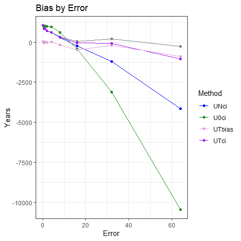
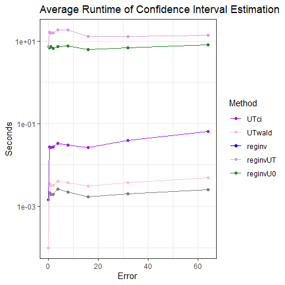
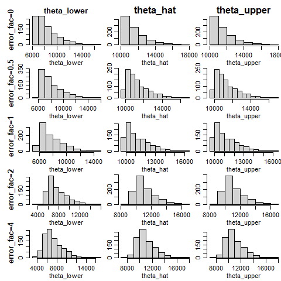

Simulation Results
================
Victor Tsang
22 August, 2023

- <a href="#tldr" id="toc-tldr">TL;DR</a>
- <a href="#point-estimates" id="toc-point-estimates">Point Estimates</a>
  - <a href="#plots" id="toc-plots">Plots</a>
  - <a href="#commentary" id="toc-commentary">Commentary</a>
- <a href="#confidence-intervals" id="toc-confidence-intervals">Confidence
  Intervals</a>
  - <a href="#coverage-probability" id="toc-coverage-probability">Coverage
    Probability</a>
  - <a href="#widths" id="toc-widths">Widths</a>
  - <a href="#runtime" id="toc-runtime">Runtime</a>
  - <a href="#commentary-1" id="toc-commentary-1">Commentary</a>

# TL;DR

- MINMI point estimates aren’t as accurate as other methods (MLE) in
  high measurement error variation scenarios, because the minimum is not
  sufficient in the measurement error setting
- MINMI point estimates appear to be more biased in high measurement
  error settings and also more variable.
- As expected, MLE_INV is much slower than MINMI and asymptotic MLE
  approaches.
- Asymptotic MLE approaches have poor coverage probability when sample
  size and measurement error are both small, and as expected, MINMI and
  MLE_INV do fine on coverage.
- MINMI has wide confidence intervals when there is measurement error
  (because of inefficiency using minimum as statistic)

------------------------------------------------------------------------

#### Load in the results

``` r
library(knitr)
library(tidyverse)
library(scales)
library(ggrepel)
library(gridExtra)
library(latex2exp)


load("data/synthetic-data-36-20230822.RData")
attach(synthetic.data.config)

RESULTS_PATH <- 'data/simResults-36-20230822.RData'
load(RESULTS_PATH)

head(results)
```

    ##   which_sim n.samples error_factor       method     lower    point    upper
    ## 1         1        36            0        MINMI  9141.477 10008.49 10192.13
    ## 2         1        36            0    mlereginv  9087.341       NA 10191.99
    ## 3         1        36            0   reginvUNci 10199.029 10199.03 10199.03
    ## 4         1        36            0 reginvUNwald 10199.029 10199.03 10199.03
    ## 5         1        36            0  mlereginvUT  9145.007       NA 10191.37
    ## 6         1        36            0   reginvUTci 10199.029 10199.03 10199.03
    ##   point_runtime conf_int_runtime B.lower B.point B.upper
    ## 1  9.727478e-05     9.727478e-05      NA      NA      NA
    ## 2  6.103516e-05     8.233516e+00      NA      NA      NA
    ## 3  0.000000e+00     8.862019e-04      NA      NA      NA
    ## 4  0.000000e+00     1.087189e-04      NA      NA      NA
    ## 5  5.841255e-05     8.422576e+00      NA      NA      NA
    ## 6  0.000000e+00     8.594990e-04      NA      NA      NA

``` r
results %>%
  group_by(method, error_factor) %>%
  summarise(point.pct_na = mean(point,na.rm=TRUE),
            lower.pct_na = mean(lower,na.rm=TRUE),
            upper.pct_na = mean(upper,na.rm=TRUE))
```

    ## `summarise()` has grouped output by 'method'. You can override using the
    ## `.groups` argument.

    ## # A tibble: 42 × 5
    ## # Groups:   method [7]
    ##    method    error_factor point.pct_na lower.pct_na upper.pct_na
    ##    <chr>            <dbl>        <dbl>        <dbl>        <dbl>
    ##  1 MINMI              0         10073.        9211.       10255.
    ##  2 MINMI              0.5       10039.        9174.       10265.
    ##  3 MINMI              1          9909.        9032.       10210.
    ##  4 MINMI              2          9590.        8664.       10052.
    ##  5 MINMI              4          7722.        6526.        8516.
    ##  6 MINMI              8          -533.       -2735.         970.
    ##  7 mlereginv          0           NaN         9210.       10255.
    ##  8 mlereginv          0.5         NaN         9175.       10265.
    ##  9 mlereginv          1           NaN         9040.       10208.
    ## 10 mlereginv          2           NaN         8680.       10038.
    ## # ℹ 32 more rows

# Point Estimates

#### Calculate Metrics

``` r
performance.point <- results %>%
  filter(!is.na(point)) %>%
  group_by(error_factor, method) %>%
  summarise(MSE_000 = mean((point - theta.true)^2,na.rm=TRUE)/1000,
            bias = mean(point,na.rm=TRUE)-theta.true,
            variance_000 = var(point,na.rm=TRUE)/1000,
            avg_runtime = round(mean(point_runtime,na.rm=TRUE), 5))
```

    ## `summarise()` has grouped output by 'error_factor'. You can override using the
    ## `.groups` argument.

``` r
performance.point.tbl = vector(mode = "list", length(error_factors))

for (i in 1:length(error_factors)) {
  performance.point.tbl[[i]] <- performance.point %>%
    filter(error_factor == error_factors[i]) %>%
    ungroup() %>%
    mutate(across(!c(error_factor, method, avg_runtime), round)) %>%
    mutate(avg_runtime = round(avg_runtime, digits = 5)) %>%
    arrange(MSE_000)
}

performance.point.tbl[[1]]
```

    ## # A tibble: 5 × 6
    ##   error_factor method       MSE_000  bias variance_000 avg_runtime
    ##          <dbl> <chr>          <dbl> <dbl>        <dbl>       <dbl>
    ## 1            0 MINMI             76    73           70     0.00009
    ## 2            0 reginvUNci       136   262           68     0      
    ## 3            0 reginvUNwald     136   262           68     0      
    ## 4            0 reginvUTci       136   262           68     0      
    ## 5            0 reginvUTwald     136   262           68     0

``` r
performance.point.tbl[[2]]
```

    ## # A tibble: 5 × 6
    ##   error_factor method       MSE_000  bias variance_000 avg_runtime
    ##          <dbl> <chr>          <dbl> <dbl>        <dbl>       <dbl>
    ## 1          0.5 reginvUTci       193   171          164    108.    
    ## 2          0.5 reginvUTwald     193   171          164    108.    
    ## 3          0.5 MINMI            198    39          197      0.0628
    ## 4          0.5 reginvUNci       216   161          190     93.9   
    ## 5          0.5 reginvUNwald     216   161          190     93.9

``` r
performance.point.tbl[[3]]
```

    ## # A tibble: 5 × 6
    ##   error_factor method       MSE_000  bias variance_000 avg_runtime
    ##          <dbl> <chr>          <dbl> <dbl>        <dbl>       <dbl>
    ## 1            1 reginvUTci       517    69          512    154.    
    ## 2            1 reginvUTwald     517    69          512    154.    
    ## 3            1 reginvUNci      2407    10         2409    148.    
    ## 4            1 reginvUNwald    2407    10         2409    148.    
    ## 5            1 MINMI           2497   -91         2492      0.0675

``` r
performance.point.tbl[[4]]
```

    ## # A tibble: 5 × 6
    ##   error_factor method       MSE_000  bias variance_000 avg_runtime
    ##          <dbl> <chr>          <dbl> <dbl>        <dbl>       <dbl>
    ## 1            2 reginvUTci      2245  -142         2227    248.    
    ## 2            2 reginvUTwald    2245  -142         2227    248.    
    ## 3            2 reginvUNci      3897  -308         3806    236.    
    ## 4            2 reginvUNwald    3897  -308         3806    236.    
    ## 5            2 MINMI           4086  -410         3922      0.0770

``` r
performance.point.tbl[[5]]
```

    ## # A tibble: 5 × 6
    ##   error_factor method       MSE_000  bias variance_000 avg_runtime
    ##          <dbl> <chr>          <dbl> <dbl>        <dbl>       <dbl>
    ## 1            4 reginvUTci      4024  -321         3925    448.    
    ## 2            4 reginvUTwald    4024  -321         3925    448.    
    ## 3            4 reginvUNci    652239 -2072       648629    388.    
    ## 4            4 reginvUNwald  652239 -2072       648629    388.    
    ## 5            4 MINMI         676628 -2278       672145      0.0785

#### Pivot to make plots

``` r
performance.point.long <- performance.point %>%
  rename(Error = error_factor, Method = method, Bias = bias, Var_000 = variance_000, Runtime = avg_runtime) %>%
  pivot_longer(cols=c(MSE_000, Bias, Var_000, Runtime), names_to = "Metric")
  
performance.point.long
```

    ## # A tibble: 120 × 4
    ## # Groups:   Error [6]
    ##    Error Method       Metric      value
    ##    <dbl> <chr>        <chr>       <dbl>
    ##  1     0 MINMI        MSE_000  75.6    
    ##  2     0 MINMI        Bias     72.6    
    ##  3     0 MINMI        Var_000  70.4    
    ##  4     0 MINMI        Runtime   0.00009
    ##  5     0 reginvUNci   MSE_000 136.     
    ##  6     0 reginvUNci   Bias    262.     
    ##  7     0 reginvUNci   Var_000  67.8    
    ##  8     0 reginvUNci   Runtime   0      
    ##  9     0 reginvUNwald MSE_000 136.     
    ## 10     0 reginvUNwald Bias    262.     
    ## # ℹ 110 more rows

### Plots

``` r
metrics = unique(performance.point.long$Metric)
performance.point_estimates.plots = lapply(metrics,
  function(met) {
    p = ggplot(data = filter(performance.point.long, Metric == met),
               mapping = aes(x = Error, y = value, colour = reorder(Method, value, decreasing=T))) +
      geom_line() +
      geom_point() +
      theme_bw() +
      labs(title = paste(met, "by Error"), ylab=NULL, colour = "Method") +
      theme(rect = element_rect(fill = "transparent")) +
      scale_color_manual(values = c("MINMI" = "#00BA38",
                                    "MLE" = "#619CFF",
                                    "BA-MLE" = "purple",
                                    "Strauss" = "orange",
                                    "GRIWM-corrected" = "darkgray",
                                    "GRIWM" = "maroon",
                                    "reginvUNci" = "darkblue",
                                    "reginvUNwald" = "red",
                                    "mlereginv" = "purple",
                                    "reginvUTci" = "lightblue",
                                    "reginvUTwald" = "pink",
                                    "mlereginvUT" = "plum",
                                    "mleInvAW" = "pink"))
    
    if (met %in% c("MSE", "Runtime")) {
      p = p+scale_y_log10(labels = label_comma())
    }
    p
  }
)

performance.point_estimates.plots[[1]] = performance.point_estimates.plots[[1]] + ylab("000's")
performance.point_estimates.plots[[2]] = performance.point_estimates.plots[[2]] + ylab("Years")
performance.point_estimates.plots[[3]] = performance.point_estimates.plots[[3]] + ylab("000's")
performance.point_estimates.plots[[4]] = performance.point_estimates.plots[[4]] + ylab("Seconds")

performance.point_estimates.plots[[1]]
```

<!-- -->

``` r
performance.point_estimates.plots[[2]]
```

<!-- -->

``` r
performance.point_estimates.plots[[3]]
```

<!-- -->

``` r
performance.point_estimates.plots[[4]]
```

    ## Warning: Transformation introduced infinite values in continuous y-axis
    ## Transformation introduced infinite values in continuous y-axis

<!-- -->

## Commentary

1.  MSE:
    1.  MINMI generally produces estimates with similar MSE to the MLE
    2.  MINMI had the worst MSE in
        
        scenarios and was moderately bad in the
        
        scenario
2.  Bias:
    1.  MINMI does OK but has poor bias in the
        
        scenario, when minimum is clearly not the optimal statistic.
3.  Variance:
    1.  MINMI estimates generally have more variance than the other
        methods, especially in high measurement error scenarios.
4.  Runtime:
    1.  MINMI is comparable to MLE

``` r
performance.point_estimates.plot.grid = do.call(grid.arrange, performance.point_estimates.plots)
```

    ## Warning: Transformation introduced infinite values in continuous y-axis
    ## Transformation introduced infinite values in continuous y-axis

<!-- -->

``` r
performance.point_estimates.plot.grid
```

    ## TableGrob (2 x 2) "arrange": 4 grobs
    ##   z     cells    name           grob
    ## 1 1 (1-1,1-1) arrange gtable[layout]
    ## 2 2 (1-1,2-2) arrange gtable[layout]
    ## 3 3 (2-2,1-1) arrange gtable[layout]
    ## 4 4 (2-2,2-2) arrange gtable[layout]

# Confidence Intervals

#### Calculate Metrics and Pivot

``` r
performance.CI <- results %>%
  filter(!is.na(conf_int_runtime)) %>%
  mutate(width = upper - lower,
         contains_theta = ifelse(theta.true > lower & theta.true < upper, 1, 0)) %>%
#         contains_theta = ifelse(theta.true > lower, 1, 0)) %>%
#         contains_theta = ifelse(theta.true < upper, 1, 0)) %>%
  group_by(error_factor, method) %>%
  summarise(Coverage = round(mean(contains_theta, na.rm=TRUE) * 100, 1),
            `Average Width` = round(mean(width, na.rm=TRUE), 2),
            `Average Runtime` = round(mean(conf_int_runtime, na.rm=TRUE), 5)) %>%
  ungroup() %>%
  arrange(method, error_factor)
```

    ## `summarise()` has grouped output by 'error_factor'. You can override using the
    ## `.groups` argument.

``` r
performance.CI.long <- performance.CI %>%
  rename(Error = error_factor, Method = method, Width = `Average Width`, Runtime = `Average Runtime`) %>%
  pivot_longer(cols=c(Coverage, Width, Runtime),
               names_to = "Metric")
  
performance.CI.long
```

    ## # A tibble: 126 × 4
    ##    Error Method Metric        value
    ##    <dbl> <chr>  <chr>         <dbl>
    ##  1   0   MINMI  Coverage   95.3    
    ##  2   0   MINMI  Width    1044.     
    ##  3   0   MINMI  Runtime     0.00009
    ##  4   0.5 MINMI  Coverage   89.4    
    ##  5   0.5 MINMI  Width    1091.     
    ##  6   0.5 MINMI  Runtime     0.0628 
    ##  7   1   MINMI  Coverage   85.8    
    ##  8   1   MINMI  Width    1178.     
    ##  9   1   MINMI  Runtime     0.0675 
    ## 10   2   MINMI  Coverage   79.7    
    ## # ℹ 116 more rows

## Coverage Probability

``` r
conf_int.coverage.plot <- performance.CI.long %>%
  filter(Metric == "Coverage") %>%
  ggplot(aes(x=Error, y=value, colour=reorder(Method, value, decreasing=T))) +
  geom_point() +
  geom_line(linewidth=0.5) +
  geom_label_repel(aes(label = value)) +
  theme_bw() +
  labs(y = "Years", colour="Method", title="Coverage Probabilities") +
  scale_y_continuous(breaks=c(0, 25, 50, 75, 95, 100)) +
  theme(rect = element_rect(fill = "transparent")) +
  scale_color_manual(values = c("GRIWM" = "#F8766D", "GRIWM-corrected" = "#619CFF", "MINMI" = "#00BA38",                                     "reginvUNci" = "darkblue",
                                    "reginvUNwald" = "red",
                                    "mlereginv" = "purple",
                                    "reginvUTci" = "lightblue",
                                    "reginvUTwald" = "pink",
                                    "mlereginvUT" = "plum",
                                    "mleInvAW" = "pink"))
```

    ## Warning: Ignoring unknown parameters: linewidth

``` r
conf_int.coverage.plot
```

    ## Warning: ggrepel: 19 unlabeled data points (too many overlaps). Consider
    ## increasing max.overlaps

<!-- -->

## Widths

``` r
conf_int.width.plot <- performance.CI.long %>%
  filter(Metric == "Width") %>%
  ggplot(aes(x=Error, y=value, colour=reorder(Method, value, decreasing=T))) +
  geom_point() +
  geom_line(linewidth=0.5) +
  theme_bw() +
  labs(y = "Years", colour="Method", title="Average Width of Estimated Confidence Intervals") +
  theme(rect = element_rect(fill = "transparent")) +
  scale_color_manual(values = c("GRIWM" = "#F8766D", "GRIWM-corrected" = "#619CFF", "MINMI" = "#00BA38",
                                                                    "reginvUNci" = "darkblue",
                                    "reginvUNwald" = "red",
                                    "mlereginv" = "purple",
                                    "reginvUTci" = "lightblue",
                                    "reginvUTwald" = "pink",
                                    "mlereginvUT" = "plum",
                                    "mleInvAW" = "pink"))
```

    ## Warning: Ignoring unknown parameters: linewidth

``` r
conf_int.width.plot
```

<!-- -->

## Runtime

``` r
conf_int.runtime.plot <- performance.CI.long %>%
  filter(Metric == "Runtime") %>%
  ggplot(aes(x=Error, y=value, colour=reorder(Method, value, decreasing=T))) +
  geom_point() +
  geom_line(linewidth=0.5) +
  theme_bw() +
  scale_y_continuous(trans=scales::log10_trans()) +
  labs(y = "Seconds", colour="Method", title="Average Runtime of Confidence Interval Estimation") +
  theme(rect = element_rect(fill = "transparent")) +
  scale_color_manual(values = c("GRIWM" = "#F8766D", "GRIWM-corrected" = "#619CFF", "MINMI" = "#00BA38", 
                                                                    "reginvUNci" = "darkblue",
                                    "reginvUNwald" = "red",
                                    "mlereginv" = "purple",
                                    "reginvUTci" = "lightblue",
                                    "reginvUTwald" = "pink",
                                    "mlereginvUT" = "plum",
                                    "mleInvAW" = "pink"))
```

    ## Warning: Ignoring unknown parameters: linewidth

``` r
conf_int.runtime.plot
```

<!-- -->

## Commentary

1.  Coverage Probability:
    1.  MINMI and MLE_INV have good coverage as expected
    2.  Asymptotic MLE methods have poor coverage for small n and small
        measurement error, especially Wald
2.  Confidence Interval Widths:
    1.  MINMI has consistently wider CI’s
    2.  MLE_INV is also a bit wider, expected since other methods have
        undercoverage, although diff bigger than expected
3.  Runtime
    1.  MLE_INV much slower than everything else, and surprisingly,
        asymptotic MLE methods faster than MINMI.

#### Bonus: measurement error variation relative to our sampling error variation?

``` r
pct_sigma_sampling <- 4*fossil.sd / (K-theta.true)

tibble(index = 1:n.samples, pct_sigma_sampling) %>%
  mutate(label = ifelse(pct_sigma_sampling > 0.3, percent(pct_sigma_sampling), "")) %>%
  ggplot(aes(x=index, y=pct_sigma_sampling)) +
  geom_point() +
  geom_label_repel(aes(label=label)) + 
  labs(x = 'Sample Index', y = '% of K - theta', title="Measurement Error Variation Relative to Sample Error Variation", subtitle = "(4sigma scenario)") +
  scale_y_continuous(labels = percent_format())
```

<!-- -->

``` r
tibble(index = 1:n.samples, pct_sigma_sampling) %>%
  ggplot(aes(x=pct_sigma_sampling)) +
  geom_histogram(binwidth=0.05) +
  scale_x_continuous(labels = percent_format())
```

<!-- -->

Under

scenario, we have a right skewed distribution. Our fossils are mostly
\<30% of
,
but we do get some samples with super large measurement error variation.
Perhaps these cause problems?

#### Extra bonus: is the sampling distribution of MLE Gaussian for ?

``` r
errors=unique(results$error_factor)
nError=length(errors)
par(mfrow=c(5,3),mgp=c(1.75,0.75,0),mar=c(3,2,0,0),oma=c(0,2,2,0))
for(iError in 1:nError)
{
  tmp=results%>%filter(method=="reginvUNci" & error_factor==errors[iError]) %>% select(lower,point,upper)
  hist(tmp$lower,xlab="theta_lower",ylab="",main="")
  mtext(paste0("error_fac=",errors[iError]),2,line=2,font=2,cex=0.8)
  if(iError==1)
    mtext("theta_lower",3,font=2,cex=0.8)
  hist(tmp$point,xlab="theta_hat",ylab="",main="")
  if(iError==1)
    mtext("theta_hat",3,font=2)
  hist(tmp$point,xlab="theta_upper",ylab="",main="")
  if(iError==1)
    mtext("theta_upper",3,font=2)
}
```

<!-- --><!-- -->

Um, yes! Not at , as expected, because this is a sample minimum.

Quantiles also seem to be approx normal with no outliers (except at 0=4
where it looks like there is some non-convergence).

#### How good are standard error estimates?

``` r
errors=unique(results$error_factor)
nError=length(errors)
par(mfrow=c(3,2),mgp=c(1.75,0.75,0),mar=c(3,2,0,0),oma=c(0,2,2,0))
for(iError in 1:nError)
{
  tmp=results%>%filter(method=="reginvUNwald" & error_factor==errors[iError]) %>% select(point,point_runtime)
  nError=length(errors)
  hist(tmp$point_runtime,xlab="SE",ylab="",main="")
  abline(v=sd(tmp$point),col="red")
}
```

<!-- -->
