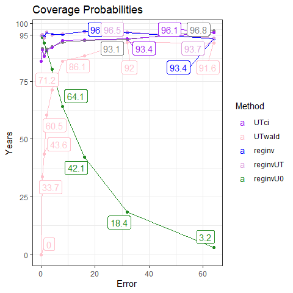

Simulation Results
================
Victor Tsang
15 February, 2023

- <a href="#tldr" id="toc-tldr">TL;DR</a>
- <a href="#point-estimates" id="toc-point-estimates">Point Estimates</a>
  - <a href="#plots" id="toc-plots">Plots</a>
  - <a href="#commentary" id="toc-commentary">Commentary</a>
- <a href="#confidence-intervals" id="toc-confidence-intervals">Confidence
  Intervals</a>
  - <a href="#coverage-probability" id="toc-coverage-probability">Coverage
    Probability</a>
  - <a href="#widths" id="toc-widths">Widths</a>
  - <a href="#runtime" id="toc-runtime">Runtime</a>
  - <a href="#commentary-1" id="toc-commentary-1">Commentary</a>

# TL;DR

- MINMI point estimates aren’t as accurate as other methods (MLE,
  BA-MLE, Strauss) in high measurement error variation scenarios.
  Possibly due to $\varepsilon < K - \theta$?
- MINMI point estimates appear to be more biased and also more variable
  under both $\delta$ and $\varepsilon$ models.
- As expected, MINMI is much faster than GRIWM.
- Coverage probability of MINMI is lower than expected in a the
  $4\sigma$ scenario. Again, possibly related to
  $\varepsilon < K - \theta$, but unsure.

------------------------------------------------------------------------

#### Load in the results

``` r
library(knitr)
library(tidyverse)
library(scales)
library(ggrepel)
library(gridExtra)
library(latex2exp)


load("data/synthetic-data.RData")
attach(synthetic.data.config)

RESULTS_PATH <- 'data/simResults.RData'
load(RESULTS_PATH)

head(results)
```

    ##   error_factor          method    lower    point    upper point_runtime
    ## 1            0         Strauss       NA 14973.11       NA  2.193451e-05
    ## 2            0             MLE       NA 15073.05       NA  1.435041e-03
    ## 3            0          BA-MLE       NA 14974.51       NA  2.193451e-05
    ## 4            0           MINMI 14695.81 15004.28 15070.56  2.781296e-02
    ## 5            0           GRIWM 14779.00 14779.00 14779.00  1.442542e+00
    ## 6            0 GRIWM-corrected 15004.00 15004.00 15004.00  3.216715e+01
    ##   conf_int_runtime B.lower B.point B.upper
    ## 1               NA      NA      NA      NA
    ## 2               NA      NA      NA      NA
    ## 3               NA      NA      NA      NA
    ## 4       0.02781296      NA      NA      NA
    ## 5       1.44254208      NA      NA      NA
    ## 6      32.16714787      NA      NA      NA

``` r
results %>%
  group_by(method, error_factor) %>%
  summarise(point.pct_na = sum(is.na(point))/n(),
            lower.pct_na = sum(is.na(lower))/n(),
            upper.pct_na = sum(is.na(upper))/n())
```

    ## `summarise()` has grouped output by 'method'. You can override using the
    ## `.groups` argument.

    ## # A tibble: 30 × 5
    ## # Groups:   method [6]
    ##    method error_factor point.pct_na lower.pct_na upper.pct_na
    ##    <chr>         <dbl>        <dbl>        <dbl>        <dbl>
    ##  1 BA-MLE          0              0            1            1
    ##  2 BA-MLE          0.5            0            1            1
    ##  3 BA-MLE          1              0            1            1
    ##  4 BA-MLE          2              0            1            1
    ##  5 BA-MLE          4              0            1            1
    ##  6 GRIWM           0              0            0            0
    ##  7 GRIWM           0.5            0            0            0
    ##  8 GRIWM           1              0            0            0
    ##  9 GRIWM           2              0            0            0
    ## 10 GRIWM           4              0            0            0
    ## # … with 20 more rows

# Point Estimates

#### Calculate Metrics

``` r
performance.point <- results %>%
  filter(!is.na(point)) %>%
  group_by(error_factor, method) %>%
  summarise(MSE_000 = mean((point - theta.true)^2)/1000,
            bias = mean(point)-theta.true,
            variance_000 = var(point)/1000,
            avg_runtime = round(mean(point_runtime), 5))
```

    ## `summarise()` has grouped output by 'error_factor'. You can override using the
    ## `.groups` argument.

``` r
performance.point.tbl = vector(mode = "list", length(error_factors))

for (i in 1:length(error_factors)) {
  performance.point.tbl[[i]] <- performance.point %>%
    filter(error_factor == error_factors[i]) %>%
    ungroup() %>%
    mutate(across(!c(error_factor, method, avg_runtime), round)) %>%
    mutate(avg_runtime = round(avg_runtime, digits = 5)) %>%
    arrange(MSE_000)
}

performance.point.tbl[[1]]
```

    ## # A tibble: 6 × 6
    ##   error_factor method          MSE_000  bias variance_000 avg_runtime
    ##          <dbl> <chr>             <dbl> <dbl>        <dbl>       <dbl>
    ## 1            0 BA-MLE                9    -1            9     0.00002
    ## 2            0 Strauss               9    -1            9     0.00002
    ## 3            0 GRIWM-corrected      10    28            9    56.0    
    ## 4            0 MINMI                10    28            9     0.0001 
    ## 5            0 MLE                  18    97            9     0.00002
    ## 6            0 GRIWM                48  -195           10     1.11

``` r
performance.point.tbl[[2]]
```

    ## # A tibble: 6 × 6
    ##   error_factor method          MSE_000  bias variance_000 avg_runtime
    ##          <dbl> <chr>             <dbl> <dbl>        <dbl>       <dbl>
    ## 1          0.5 MLE                  37     6           37     0.00001
    ## 2          0.5 MINMI                38   -14           38     0.114  
    ## 3          0.5 GRIWM-corrected      42   -64           38    30.6    
    ## 4          0.5 BA-MLE               47   -94           38     0.00002
    ## 5          0.5 Strauss              47   -94           38     0.00002
    ## 6          0.5 GRIWM               126  -291           41     1.12

``` r
performance.point.tbl[[3]]
```

    ## # A tibble: 6 × 6
    ##   error_factor method          MSE_000  bias variance_000 avg_runtime
    ##          <dbl> <chr>             <dbl> <dbl>        <dbl>       <dbl>
    ## 1            1 MINMI               184   -77          179     0.130  
    ## 2            1 MLE                 199  -186          165     0.00001
    ## 3            1 GRIWM-corrected     236  -258          170    30.9    
    ## 4            1 BA-MLE              255  -290          172     0.00002
    ## 5            1 Strauss             256  -290          172     0.00002
    ## 6            1 GRIWM               430  -495          185     1.13

``` r
performance.point.tbl[[4]]
```

    ## # A tibble: 6 × 6
    ##   error_factor method          MSE_000  bias variance_000 avg_runtime
    ##          <dbl> <chr>             <dbl> <dbl>        <dbl>       <dbl>
    ## 1            2 MINMI               568  -155          545     0.139  
    ## 2            2 MLE                 895  -652          471     0.00001
    ## 3            2 GRIWM-corrected    1018  -731          484    31.0    
    ## 4            2 BA-MLE             1075  -765          490     0.00002
    ## 5            2 Strauss            1076  -766          490     0.00002
    ## 6            2 GRIWM              1506  -989          529     1.12

``` r
performance.point.tbl[[5]]
```

    ## # A tibble: 6 × 6
    ##   error_factor method          MSE_000  bias variance_000 avg_runtime
    ##          <dbl> <chr>             <dbl> <dbl>        <dbl>       <dbl>
    ## 1            4 MLE                6976 -2019         2903     0.00002
    ## 2            4 GRIWM-corrected    7463 -2117         2986    31.1    
    ## 3            4 BA-MLE             7680 -2159         3020     0.00002
    ## 4            4 Strauss            7687 -2160         3022     0.00002
    ## 5            4 GRIWM              9200 -2438         3261     1.12   
    ## 6            4 MINMI             14574 -3202         4342     0.144

#### Pivot to make plots

``` r
performance.point.long <- performance.point %>%
  rename(Error = error_factor, Method = method, Bias = bias, Var_000 = variance_000, Runtime = avg_runtime) %>%
  pivot_longer(cols=c(MSE_000, Bias, Var_000, Runtime), names_to = "Metric")
  
performance.point.long
```

    ## # A tibble: 120 × 4
    ## # Groups:   Error [5]
    ##    Error Method          Metric       value
    ##    <dbl> <chr>           <chr>        <dbl>
    ##  1     0 BA-MLE          MSE_000    9.06   
    ##  2     0 BA-MLE          Bias      -1.14   
    ##  3     0 BA-MLE          Var_000    9.06   
    ##  4     0 BA-MLE          Runtime    0.00002
    ##  5     0 GRIWM           MSE_000   47.9    
    ##  6     0 GRIWM           Bias    -195.     
    ##  7     0 GRIWM           Var_000    9.79   
    ##  8     0 GRIWM           Runtime    1.11   
    ##  9     0 GRIWM-corrected MSE_000    9.75   
    ## 10     0 GRIWM-corrected Bias      28.3    
    ## # … with 110 more rows

### Plots

``` r
metrics = unique(performance.point.long$Metric)
performance.point_estimates.plots = lapply(metrics,
  function(met) {
    p = ggplot(data = filter(performance.point.long, Metric == met),
               mapping = aes(x = Error, y = value, colour = reorder(Method, value, decreasing=T))) +
      geom_line() +
      geom_point() +
      theme_bw() +
      labs(title = paste(met, "by Error"), ylab=NULL, colour = "Method") +
      theme(rect = element_rect(fill = "transparent")) +
      scale_color_manual(values = c("MINMI" = "#00BA38",
                                    "MLE" = "#619CFF",
                                    "BA-MLE" = "purple",
                                    "Strauss" = "orange",
                                    "GRIWM-corrected" = "darkgray",
                                    "GRIWM" = "maroon"))
    
    if (met %in% c("MSE", "Runtime")) {
      p = p+scale_y_log10(labels = label_comma())
    }
    p
  }
)

performance.point_estimates.plots[[1]] = performance.point_estimates.plots[[1]] + ylab("000's")
performance.point_estimates.plots[[2]] = performance.point_estimates.plots[[2]] + ylab("Years")
performance.point_estimates.plots[[3]] = performance.point_estimates.plots[[3]] + ylab("000's")
performance.point_estimates.plots[[4]] = performance.point_estimates.plots[[4]] + ylab("Seconds")

performance.point_estimates.plots[[1]]
```

<!-- -->

``` r
performance.point_estimates.plots[[2]]
```

<!-- -->

``` r
performance.point_estimates.plots[[3]]
```

<!-- -->

``` r
performance.point_estimates.plots[[4]]
```

<!-- -->

## Commentary

1.  MSE:
    1.  MINMI generally produces estimates with similar MSE to the MLE
    2.  MINMI had the worst MSE in $4\sigma$ scenarios and was
        moderately bad in the $0\sigma$ scenario
2.  Bias:
    1.  MINMI is more biased than everything else
    2.  For some reason, it’s substantially more negatively biased in
        the $4\sigma$ scenario. Possibly related to the
        $\varepsilon < K - \theta$, meaning our measurement errors are
        negatively skewed, which “pull” our MINMI estimates downwards?
3.  Variance:
    1.  MINMI estimates generally have more variance than the other
        methods, likely due to it accounting for both sampling and
        measurement error.
    2.  **Question: Why do we have greater bias and greater variance?
        Seems counterintuitive considering that it’s common to see a
        bias-variance tradeoff.**
4.  Runtime:
    1.  $\delta$ model: MINMI is comparable to BA-MLE, Strauss, and MLE
        and is 10,000 times faster than GRIWM.
    2.  In $\varepsilon$ model: MINMI is faster than GRIWM by \~10x

``` r
performance.point_estimates.plot.grid = do.call(grid.arrange, performance.point_estimates.plots)
```

<!-- -->

``` r
performance.point_estimates.plot.grid
```

    ## TableGrob (2 x 2) "arrange": 4 grobs
    ##   z     cells    name           grob
    ## 1 1 (1-1,1-1) arrange gtable[layout]
    ## 2 2 (1-1,2-2) arrange gtable[layout]
    ## 3 3 (2-2,1-1) arrange gtable[layout]
    ## 4 4 (2-2,2-2) arrange gtable[layout]

# Confidence Intervals

#### Calculate Metrics and Pivot

``` r
performance.CI <- results %>%
  filter(!is.na(conf_int_runtime)) %>%
  mutate(width = upper - lower,
         contains_theta = ifelse(theta.true > lower & theta.true < upper, 1, 0)) %>%
  group_by(error_factor, method) %>%
  summarise(Coverage = round(mean(contains_theta) * 100, 1),
            `Average Width` = round(mean(width), 2),
            `Average Runtime` = round(mean(conf_int_runtime), 5)) %>%
  ungroup() %>%
  arrange(method, error_factor)
```

    ## `summarise()` has grouped output by 'error_factor'. You can override using the
    ## `.groups` argument.

``` r
performance.CI.long <- performance.CI %>%
  rename(Error = error_factor, Method = method, Width = `Average Width`, Runtime = `Average Runtime`) %>%
  pivot_longer(cols=c(Coverage, Width, Runtime),
               names_to = "Metric")
  
performance.CI.long
```

    ## # A tibble: 45 × 4
    ##    Error Method Metric     value
    ##    <dbl> <chr>  <chr>      <dbl>
    ##  1   0   GRIWM  Coverage    0   
    ##  2   0   GRIWM  Width       0   
    ##  3   0   GRIWM  Runtime     1.11
    ##  4   0.5 GRIWM  Coverage   43.8 
    ##  5   0.5 GRIWM  Width     505.  
    ##  6   0.5 GRIWM  Runtime     1.12
    ##  7   1   GRIWM  Coverage   62.7 
    ##  8   1   GRIWM  Width    1010.  
    ##  9   1   GRIWM  Runtime     1.13
    ## 10   2   GRIWM  Coverage   59.6 
    ## # … with 35 more rows

## Coverage Probability

``` r
conf_int.coverage.plot <- performance.CI.long %>%
  filter(Metric == "Coverage") %>%
  ggplot(aes(x=Error, y=value, colour=reorder(Method, value, decreasing=T))) +
  geom_point() +
  geom_line(linewidth=0.5) +
  geom_label_repel(aes(label = value)) +
  theme_bw() +
  labs(y = "Years", colour="Method", title="Coverage Probabilities") +
  scale_y_continuous(breaks=c(0, 25, 50, 75, 95, 100)) +
  theme(rect = element_rect(fill = "transparent")) +
  scale_color_manual(values = c("GRIWM" = "#F8766D", "GRIWM-corrected" = "#619CFF", "MINMI" = "#00BA38"))

conf_int.coverage.plot
```

<!-- -->

## Widths

``` r
conf_int.width.plot <- performance.CI.long %>%
  filter(Metric == "Width") %>%
  ggplot(aes(x=Error, y=value, colour=reorder(Method, value, decreasing=T))) +
  geom_point() +
  geom_line(linewidth=0.5) +
  theme_bw() +
  labs(y = "Years", colour="Method", title="Average Width of Estimated Confidence Intervals") +
  theme(rect = element_rect(fill = "transparent")) +
  scale_color_manual(values = c("GRIWM" = "#F8766D", "GRIWM-corrected" = "#619CFF", "MINMI" = "#00BA38"))

conf_int.width.plot
```

<!-- -->

## Runtime

``` r
conf_int.runtime.plot <- performance.CI.long %>%
  filter(Metric == "Runtime") %>%
  ggplot(aes(x=Error, y=value, colour=reorder(Method, value, decreasing=T))) +
  geom_point() +
  geom_line(linewidth=0.5) +
  theme_bw() +
  scale_y_continuous(trans=scales::log10_trans()) +
  labs(y = "Seconds", colour="Method", title="Average Runtime of Confidence Interval Estimation") +
  theme(rect = element_rect(fill = "transparent")) +
  scale_color_manual(values = c("GRIWM" = "#F8766D", "GRIWM-corrected" = "#619CFF", "MINMI" = "#00BA38"))

conf_int.runtime.plot
```

<!-- -->

## Commentary

1.  Coverage Probability:
    1.  MINMI generally has better coverage probability than GRIWM
    2.  In $4\sigma$ scenario, MINMI’s coverage probability drops off —
        **why?!**. Possibly due to the negative skewed nature of the
        measurement errors ($\varepsilon < K - \theta$)?
2.  Confidence Interval Widths:
    1.  MINMI has consistently wider CI’s than GRIWM — it more
        accurately represents the uncertainty associated with our
        estimates, especially as measurement error gets large.
3.  Runtime
    1.  Similar to point estimates - MINMI consistently outperforms
        everything else.

#### Bonus: measurement error variation relative to our sampling error variation?

``` r
pct_sigma_sampling <- 4*fossil.sd / (K-theta.true)

tibble(index = 1:n.samples, pct_sigma_sampling) %>%
  mutate(label = ifelse(pct_sigma_sampling > 0.3, percent(pct_sigma_sampling), "")) %>%
  ggplot(aes(x=index, y=pct_sigma_sampling)) +
  geom_point() +
  geom_label_repel(aes(label=label)) + 
  labs(x = 'Sample Index', y = '% of K - theta', title="Measurement Error Variation Relative to Sample Error Variation", subtitle = "(4sigma scenario)") +
  scale_y_continuous(labels = percent_format())
```

<!-- -->

``` r
tibble(index = 1:n.samples, pct_sigma_sampling) %>%
  ggplot(aes(x=pct_sigma_sampling)) +
  geom_histogram(binwidth=0.05) +
  scale_x_continuous(labels = percent_format())
```

<!-- -->

Under $4\sigma$ scenario, we have a right skewed distribution. Our
fossils are mostly \<30% of $K-\theta$, but we do get some samples with
super large measurement error variation. Perhaps these cause problems?
