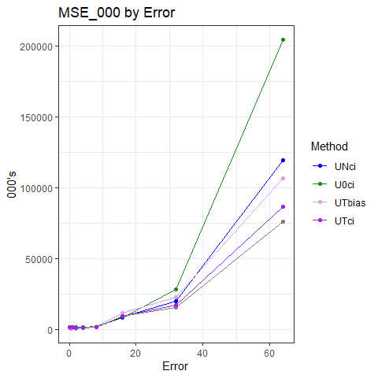
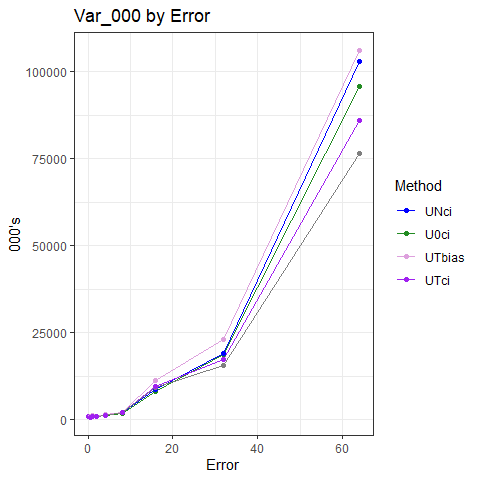
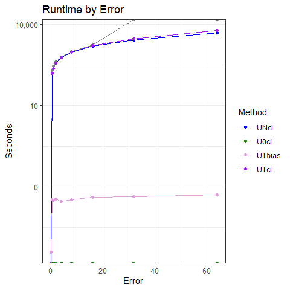
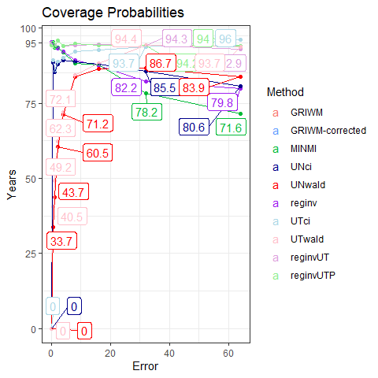
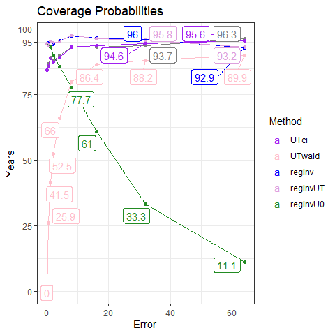

Simulation Results
================
Victor Tsang
14 June, 2023

- <a href="#tldr" id="toc-tldr">TL;DR</a>
- <a href="#point-estimates" id="toc-point-estimates">Point Estimates</a>
  - <a href="#plots" id="toc-plots">Plots</a>
  - <a href="#commentary" id="toc-commentary">Commentary</a>
- <a href="#confidence-intervals" id="toc-confidence-intervals">Confidence
  Intervals</a>
  - <a href="#coverage-probability" id="toc-coverage-probability">Coverage
    Probability</a>
  - <a href="#widths" id="toc-widths">Widths</a>
  - <a href="#runtime" id="toc-runtime">Runtime</a>
  - <a href="#commentary-1" id="toc-commentary-1">Commentary</a>

# TL;DR

- MINMI point estimates aren’t as accurate as other methods (MLE,
  BA-MLE, Strauss) in high measurement error variation scenarios.
  Possibly due to
  ?
- MINMI point estimates appear to be more biased and also more variable
  under both
  
  and
  
  models.
- As expected, MINMI is much faster than GRIWM.
- Coverage probability of MINMI is lower than expected in a the
  
  scenario. Again, possibly related to
  ,
  but unsure.

------------------------------------------------------------------------

#### Load in the results

``` r
library(knitr)
library(tidyverse)
library(scales)
library(ggrepel)
library(gridExtra)
library(latex2exp)


load("data/synthetic-data.RData")
attach(synthetic.data.config)

RESULTS_PATH <- 'data/simResults-20230614.RData'
load(RESULTS_PATH)

head(results)
```

    ##   error_factor method    lower    point    upper point_runtime conf_int_runtime
    ## 1          0.0  MINMI 14312.97 14934.48 15068.02  9.489059e-05     9.489059e-05
    ## 2          0.0   UNci 14684.29 15073.05 15073.05  1.348789e-01     1.348789e-01
    ## 3          0.5  MINMI 14335.93 14981.49 15444.01  7.917905e-02     7.917905e-02
    ## 4          0.5   UNci 14522.90 14999.20 15184.93  5.947304e-02     5.947304e-02
    ## 5          1.0  MINMI 14098.05 14829.92 15812.75  8.592701e-02     8.592701e-02
    ## 6          1.0   UNci 14344.70 14950.77 15195.59  4.842782e-02     4.842782e-02
    ##   B.lower B.point B.upper
    ## 1      NA      NA      NA
    ## 2     100     100     100
    ## 3     102     100     100
    ## 4     100     100     100
    ## 5     100     100     100
    ## 6     100     100     100

``` r
results %>%
  group_by(method, error_factor) %>%
  summarise(point.pct_na = mean(point,na.rm=TRUE),
            lower.pct_na = mean(lower,na.rm=TRUE),
            upper.pct_na = mean(upper,na.rm=TRUE))
```

    ## `summarise()` has grouped output by 'method'. You can override using the
    ## `.groups` argument.

    ## # A tibble: 10 × 5
    ## # Groups:   method [2]
    ##    method error_factor point.pct_na lower.pct_na upper.pct_na
    ##    <chr>         <dbl>        <dbl>        <dbl>        <dbl>
    ##  1 MINMI           0         14959.       14339.       15092.
    ##  2 MINMI           0.5       14889.       14239.       15355.
    ##  3 MINMI           1         14768.       14032.       15748.
    ##  4 MINMI           2         14554.       13556.       16695.
    ##  5 MINMI           4         13921.       12212.       18682.
    ##  6 UNci            0         15097.       14709.       15097.
    ##  7 UNci            0.5       14961.       14434.       15192.
    ##  8 UNci            1         14874.       14223.       15211.
    ##  9 UNci            2         14714.       13855.       15233.
    ## 10 UNci            4         14296.       13130.       15159.

# Point Estimates

#### Calculate Metrics

``` r
performance.point <- results %>%
  filter(!is.na(point)) %>%
  group_by(error_factor, method) %>%
  summarise(MSE_000 = mean((point - theta.true)^2,na.rm=TRUE)/1000,
            bias = mean(point,na.rm=TRUE)-theta.true,
            variance_000 = var(point,na.rm=TRUE)/1000,
            avg_runtime = round(mean(point_runtime,na.rm=TRUE), 5))
```

    ## `summarise()` has grouped output by 'error_factor'. You can override using the
    ## `.groups` argument.

``` r
performance.point.tbl = vector(mode = "list", length(error_factors))

for (i in 1:length(error_factors)) {
  performance.point.tbl[[i]] <- performance.point %>%
    filter(error_factor == error_factors[i]) %>%
    ungroup() %>%
    mutate(across(!c(error_factor, method, avg_runtime), round)) %>%
    mutate(avg_runtime = round(avg_runtime, digits = 5)) %>%
    arrange(MSE_000)
}

performance.point.tbl[[1]]
```

    ## # A tibble: 2 × 6
    ##   error_factor method MSE_000  bias variance_000 avg_runtime
    ##          <dbl> <chr>    <dbl> <dbl>        <dbl>       <dbl>
    ## 1            0 MINMI       11   -41            9     0.00008
    ## 2            0 UNci        18    97            9     0.00581

``` r
performance.point.tbl[[2]]
```

    ## # A tibble: 2 × 6
    ##   error_factor method MSE_000  bias variance_000 avg_runtime
    ##          <dbl> <chr>    <dbl> <dbl>        <dbl>       <dbl>
    ## 1          0.5 UNci        24   -39           22      0.0538
    ## 2          0.5 MINMI       50  -111           38      0.0964

``` r
performance.point.tbl[[3]]
```

    ## # A tibble: 2 × 6
    ##   error_factor method MSE_000  bias variance_000 avg_runtime
    ##          <dbl> <chr>    <dbl> <dbl>        <dbl>       <dbl>
    ## 1            1 UNci        52  -126           36      0.0582
    ## 2            1 MINMI      226  -232          173      0.0971

``` r
performance.point.tbl[[4]]
```

    ## # A tibble: 2 × 6
    ##   error_factor method MSE_000  bias variance_000 avg_runtime
    ##          <dbl> <chr>    <dbl> <dbl>        <dbl>       <dbl>
    ## 1            2 UNci       146  -286           64      0.0626
    ## 2            2 MINMI      709  -446          510      0.112

``` r
performance.point.tbl[[5]]
```

    ## # A tibble: 2 × 6
    ##   error_factor method MSE_000  bias variance_000 avg_runtime
    ##          <dbl> <chr>    <dbl> <dbl>        <dbl>       <dbl>
    ## 1            4 UNci      1022  -704          527      0.0631
    ## 2            4 MINMI     4471 -1079         3310      0.118

#### Pivot to make plots

``` r
performance.point.long <- performance.point %>%
  rename(Error = error_factor, Method = method, Bias = bias, Var_000 = variance_000, Runtime = avg_runtime) %>%
  pivot_longer(cols=c(MSE_000, Bias, Var_000, Runtime), names_to = "Metric")
  
performance.point.long
```

    ## # A tibble: 40 × 4
    ## # Groups:   Error [5]
    ##    Error Method Metric       value
    ##    <dbl> <chr>  <chr>        <dbl>
    ##  1   0   MINMI  MSE_000   10.7    
    ##  2   0   MINMI  Bias     -41.3    
    ##  3   0   MINMI  Var_000    8.96   
    ##  4   0   MINMI  Runtime    0.00008
    ##  5   0   UNci   MSE_000   18.1    
    ##  6   0   UNci   Bias      96.9    
    ##  7   0   UNci   Var_000    8.71   
    ##  8   0   UNci   Runtime    0.00581
    ##  9   0.5 MINMI  MSE_000   50.1    
    ## 10   0.5 MINMI  Bias    -111.     
    ## # … with 30 more rows

### Plots

``` r
metrics = unique(performance.point.long$Metric)
performance.point_estimates.plots = lapply(metrics,
  function(met) {
    p = ggplot(data = filter(performance.point.long, Metric == met),
               mapping = aes(x = Error, y = value, colour = reorder(Method, value, decreasing=T))) +
      geom_line() +
      geom_point() +
      theme_bw() +
      labs(title = paste(met, "by Error"), ylab=NULL, colour = "Method") +
      theme(rect = element_rect(fill = "transparent")) +
      scale_color_manual(values = c("MINMI" = "#00BA38",
                                    "MLE" = "#619CFF",
                                    "BA-MLE" = "purple",
                                    "Strauss" = "orange",
                                    "GRIWM-corrected" = "darkgray",
                                    "GRIWM" = "maroon",
                                    "UNci" = "darkblue"))
    
    if (met %in% c("MSE", "Runtime")) {
      p = p+scale_y_log10(labels = label_comma())
    }
    p
  }
)

performance.point_estimates.plots[[1]] = performance.point_estimates.plots[[1]] + ylab("000's")
performance.point_estimates.plots[[2]] = performance.point_estimates.plots[[2]] + ylab("Years")
performance.point_estimates.plots[[3]] = performance.point_estimates.plots[[3]] + ylab("000's")
performance.point_estimates.plots[[4]] = performance.point_estimates.plots[[4]] + ylab("Seconds")

performance.point_estimates.plots[[1]]
```

<!-- -->

``` r
performance.point_estimates.plots[[2]]
```

<!-- -->

``` r
performance.point_estimates.plots[[3]]
```

<!-- -->

``` r
performance.point_estimates.plots[[4]]
```

<!-- -->

## Commentary

1.  MSE:
    1.  MINMI generally produces estimates with similar MSE to the MLE
    2.  MINMI had the worst MSE in
        
        scenarios and was moderately bad in the
        
        scenario
2.  Bias:
    1.  MINMI is more biased than everything else
    2.  For some reason, it’s substantially more negatively biased in
        the
        
        scenario. Possibly related to the
        ,
        meaning our measurement errors are negatively skewed, which
        “pull” our MINMI estimates downwards?
3.  Variance:
    1.  MINMI estimates generally have more variance than the other
        methods, likely due to it accounting for both sampling and
        measurement error.
    2.  **Question: Why do we have greater bias and greater variance?
        Seems counterintuitive considering that it’s common to see a
        bias-variance tradeoff.**
4.  Runtime:
    1.  
        model: MINMI is comparable to BA-MLE, Strauss, and MLE and is
        10,000 times faster than GRIWM.
    2.  In
        
        model: MINMI is faster than GRIWM by \~10x

``` r
performance.point_estimates.plot.grid = do.call(grid.arrange, performance.point_estimates.plots)
```

<!-- -->

``` r
performance.point_estimates.plot.grid
```

    ## TableGrob (2 x 2) "arrange": 4 grobs
    ##   z     cells    name           grob
    ## 1 1 (1-1,1-1) arrange gtable[layout]
    ## 2 2 (1-1,2-2) arrange gtable[layout]
    ## 3 3 (2-2,1-1) arrange gtable[layout]
    ## 4 4 (2-2,2-2) arrange gtable[layout]

# Confidence Intervals

#### Calculate Metrics and Pivot

``` r
performance.CI <- results %>%
  filter(!is.na(conf_int_runtime)) %>%
  mutate(width = upper - lower,
         contains_theta = ifelse(theta.true > lower & theta.true < upper, 1, 0)) %>%
  group_by(error_factor, method) %>%
  summarise(Coverage = round(mean(contains_theta) * 100, 1),
            `Average Width` = round(mean(width), 2),
            `Average Runtime` = round(mean(conf_int_runtime), 5)) %>%
  ungroup() %>%
  arrange(method, error_factor)
```

    ## `summarise()` has grouped output by 'error_factor'. You can override using the
    ## `.groups` argument.

``` r
performance.CI.long <- performance.CI %>%
  rename(Error = error_factor, Method = method, Width = `Average Width`, Runtime = `Average Runtime`) %>%
  pivot_longer(cols=c(Coverage, Width, Runtime),
               names_to = "Metric")
  
performance.CI.long
```

    ## # A tibble: 30 × 4
    ##    Error Method Metric        value
    ##    <dbl> <chr>  <chr>         <dbl>
    ##  1   0   MINMI  Coverage   95.6    
    ##  2   0   MINMI  Width     753.     
    ##  3   0   MINMI  Runtime     0.00008
    ##  4   0.5 MINMI  Coverage   95.4    
    ##  5   0.5 MINMI  Width    1116.     
    ##  6   0.5 MINMI  Runtime     0.0964 
    ##  7   1   MINMI  Coverage   95.4    
    ##  8   1   MINMI  Width    1716.     
    ##  9   1   MINMI  Runtime     0.0971 
    ## 10   2   MINMI  Coverage   97.1    
    ## # … with 20 more rows

## Coverage Probability

``` r
conf_int.coverage.plot <- performance.CI.long %>%
  filter(Metric == "Coverage") %>%
  ggplot(aes(x=Error, y=value, colour=reorder(Method, value, decreasing=T))) +
  geom_point() +
  geom_line(linewidth=0.5) +
  geom_label_repel(aes(label = value)) +
  theme_bw() +
  labs(y = "Years", colour="Method", title="Coverage Probabilities") +
  scale_y_continuous(breaks=c(0, 25, 50, 75, 95, 100)) +
  theme(rect = element_rect(fill = "transparent")) +
  scale_color_manual(values = c("GRIWM" = "#F8766D", "GRIWM-corrected" = "#619CFF", "MINMI" = "#00BA38", "UNci" = "darkblue"))
```

    ## Warning: Ignoring unknown parameters: linewidth

``` r
conf_int.coverage.plot
```

<!-- -->

## Widths

``` r
conf_int.width.plot <- performance.CI.long %>%
  filter(Metric == "Width") %>%
  ggplot(aes(x=Error, y=value, colour=reorder(Method, value, decreasing=T))) +
  geom_point() +
  geom_line(linewidth=0.5) +
  theme_bw() +
  labs(y = "Years", colour="Method", title="Average Width of Estimated Confidence Intervals") +
  theme(rect = element_rect(fill = "transparent")) +
  scale_color_manual(values = c("GRIWM" = "#F8766D", "GRIWM-corrected" = "#619CFF", "MINMI" = "#00BA38", "UNci"="darkblue"))
```

    ## Warning: Ignoring unknown parameters: linewidth

``` r
conf_int.width.plot
```

<!-- -->

## Runtime

``` r
conf_int.runtime.plot <- performance.CI.long %>%
  filter(Metric == "Runtime") %>%
  ggplot(aes(x=Error, y=value, colour=reorder(Method, value, decreasing=T))) +
  geom_point() +
  geom_line(linewidth=0.5) +
  theme_bw() +
  scale_y_continuous(trans=scales::log10_trans()) +
  labs(y = "Seconds", colour="Method", title="Average Runtime of Confidence Interval Estimation") +
  theme(rect = element_rect(fill = "transparent")) +
  scale_color_manual(values = c("GRIWM" = "#F8766D", "GRIWM-corrected" = "#619CFF", "MINMI" = "#00BA38", "UNci"="darkblue"))
```

    ## Warning: Ignoring unknown parameters: linewidth

``` r
conf_int.runtime.plot
```

<!-- -->

## Commentary

1.  Coverage Probability:
    1.  MINMI generally has better coverage probability than GRIWM
    2.  In
        
        scenario, MINMI’s coverage probability drops off — **why?!**.
        Possibly due to the negative skewed nature of the measurement
        errors
        ()?
2.  Confidence Interval Widths:
    1.  MINMI has consistently wider CI’s than GRIWM — it more
        accurately represents the uncertainty associated with our
        estimates, especially as measurement error gets large.
3.  Runtime
    1.  Similar to point estimates - MINMI consistently outperforms
        everything else.

#### Bonus: measurement error variation relative to our sampling error variation?

``` r
pct_sigma_sampling <- 4*fossil.sd / (K-theta.true)

tibble(index = 1:n.samples, pct_sigma_sampling) %>%
  mutate(label = ifelse(pct_sigma_sampling > 0.3, percent(pct_sigma_sampling), "")) %>%
  ggplot(aes(x=index, y=pct_sigma_sampling)) +
  geom_point() +
  geom_label_repel(aes(label=label)) + 
  labs(x = 'Sample Index', y = '% of K - theta', title="Measurement Error Variation Relative to Sample Error Variation", subtitle = "(4sigma scenario)") +
  scale_y_continuous(labels = percent_format())
```

<!-- -->

``` r
tibble(index = 1:n.samples, pct_sigma_sampling) %>%
  ggplot(aes(x=pct_sigma_sampling)) +
  geom_histogram(binwidth=0.05) +
  scale_x_continuous(labels = percent_format())
```

<!-- -->

Under

scenario, we have a right skewed distribution. Our fossils are mostly
\<30% of
,
but we do get some samples with super large measurement error variation.
Perhaps these cause problems?
